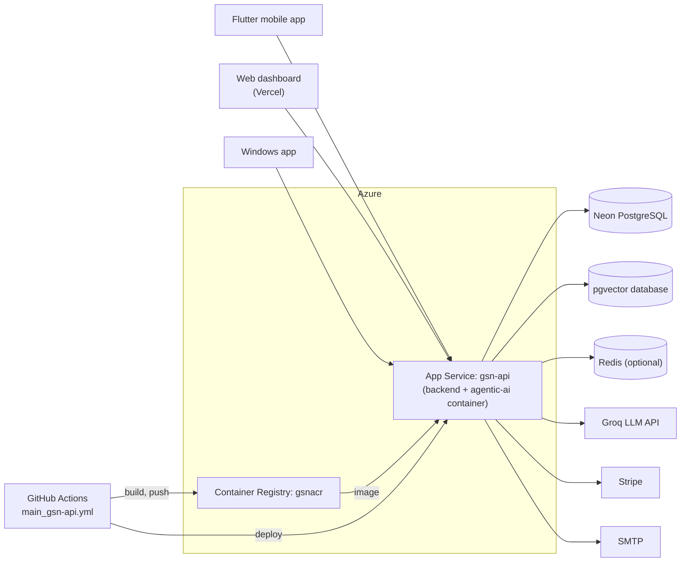

# Hosting on Azure and Vercel

This guide covers how the system is hosted, and how to set the same thing up again:

- The **backend API** (`backend/`) and the **agentic AI** layer (`agentic-ai/`) run as one Docker container on **Azure App Service** (Web App for Containers).
- The **web dashboard** (`web/`) is a static Vite build on **Vercel**.
- The **mobile app** and the **Windows app** call the hosted API by default.

The reasoning is in `docs/adr/0016-container-on-azure-app-service-web-on-vercel.md`.

| Piece | Where | Address |
|---|---|---|
| API + agents | Azure App Service `gsn-api`, Southeast Asia | `https://gsn-api-dpa2agb6c5h7gyar.southeastasia-01.azurewebsites.net` |
| Container images | Azure Container Registry `gsnacr` (private) | `gsnacr.azurecr.io/gsn-api:<commit sha>` and `:latest` |
| App database | Neon PostgreSQL | `DATABASE_URL` |
| Vector database | PostgreSQL + pgvector | `ConnectionStrings:VectorDb` |
| Web dashboard | Vercel | project root `web/` |
| LLM | Groq | `GROQ_API_KEY` |

## 1. What gets deployed

The backend and the agentic AI are **one application**, not two services.

- `agentic-ai/AgenticAi.csproj` is a class library.
- `backend/src/Government_Service_Navigator.Backend.csproj` references it with a `ProjectReference`.
- `dotnet publish` compiles both into one ASP.NET Core app.

So there is **one Docker image** and **one web app**. The Docker build runs from the **repo root** so it can see both folders.



## 2. What the host must provide

| What the code does | What hosting must provide | How it is covered |
|---|---|---|
| Targets .NET 10 (`net10.0`) | The .NET 10 runtime | The image carries its own runtime |
| Runs `InstallmentMonitorService` and `DataRepairService` as hosted services | The process must stay running | **Always On** in App Service |
| Serves a SignalR hub (`/hubs/applications`) | WebSockets | **Web sockets** on in App Service |
| Runs `Database.Migrate()` and the schema SQL on startup | Only one instance migrating at a time | One instance |
| Reads `Data/KnowledgeDocuments/*.md` for RAG ingestion | The files on disk | The Dockerfile copies them into the image |
| Stores uploaded documents and payment slips in the database | No persistent disk | The container is stateless |
| Reads settings from environment variables | App settings | App Service application settings |

## 3. The Docker files

### 3.1 `Dockerfile` (repo root)

```dockerfile
FROM mcr.microsoft.com/dotnet/sdk:10.0 AS build
WORKDIR /src

COPY backend/src/Government_Service_Navigator.Backend.csproj backend/src/
COPY agentic-ai/AgenticAi.csproj agentic-ai/
RUN dotnet restore backend/src/Government_Service_Navigator.Backend.csproj

COPY backend/ backend/
COPY agentic-ai/ agentic-ai/
RUN dotnet publish backend/src/Government_Service_Navigator.Backend.csproj \
    -c Release -o /app/publish --no-restore /p:UseAppHost=false

FROM mcr.microsoft.com/dotnet/aspnet:10.0 AS runtime
WORKDIR /app

COPY --from=build /app/publish .
COPY backend/src/Data/KnowledgeDocuments ./Data/KnowledgeDocuments

ENV ASPNETCORE_ENVIRONMENT=Production \
    ASPNETCORE_HTTP_PORTS=8080
EXPOSE 8080

USER $APP_UID
ENTRYPOINT ["dotnet", "Government_Service_Navigator.Backend.dll"]
```

- The restore layer is cached until a `.csproj` changes.
- `RagSetupController` falls back to `<current dir>/Data/KnowledgeDocuments`, which is why the knowledge files are copied next to the app.
- The API listens on `ASPNETCORE_HTTP_PORTS` (8080) when it is set, and on 5119 otherwise (`Program.cs`).
- `$APP_UID` is the non-root user that ships with the .NET images.

### 3.2 `.dockerignore` (repo root)

Keeps the build context small and stops local `.env` files from being copied into the image. It excludes `bin/`, `obj/`, `.env`, `App_Data/`, `node_modules/`, `.git/`, `.github/`, `mobile/`, `web/`, `docs/`, `load/`, `install/`, `tui-runner/` and images.

### 3.3 Test the image locally

```bash
docker build -t gsn-api .
docker run --rm -p 8080:8080 --env-file backend/src/.env gsn-api
```

Then open `http://localhost:8080/api/services`. If it returns the catalog, the image connects to the database.

> `Env.Load()` in `Program.cs` does nothing when no `.env` file exists, so in Azure all settings come from app settings.

## 4. Create the Azure resources (one time)

Pick a region close to the Neon database to keep query latency low. `gsnacr` and `gsn-api` are the live names; the resource group and plan names are examples. The registry name must be globally unique and lowercase.

```bash
RG=rg-gsn
LOCATION=southeastasia
ACR=gsnacr
PLAN=gsn-plan
APP=gsn-api

az group create --name $RG --location $LOCATION

# Private registry (the image contains appsettings.json)
az acr create --resource-group $RG --name $ACR --sku Basic

# First image, built in Azure
az acr build --registry $ACR --image gsn-api:initial .

# Linux App Service plan and the container web app
az appservice plan create --name $PLAN --resource-group $RG --is-linux --sku B1
az webapp create --name $APP --resource-group $RG --plan $PLAN \
  --container-image-name $ACR.azurecr.io/gsn-api:initial

# Let the web app pull from the registry with its managed identity
az webapp identity assign --name $APP --resource-group $RG
PRINCIPAL=$(az webapp identity show --name $APP --resource-group $RG --query principalId -o tsv)
az role assignment create --assignee $PRINCIPAL --role AcrPull \
  --scope $(az acr show --name $ACR --query id -o tsv)
az webapp config set --name $APP --resource-group $RG \
  --generic-configurations '{"acrUseManagedIdentityCreds": true}'

# Keep the process running and allow SignalR
az webapp config set --name $APP --resource-group $RG --always-on true --web-sockets-enabled true
```

Pick an App Service plan tier that supports **Always On** (Basic or above). The web app's default host name is shown with:

```bash
az webapp show --name $APP --resource-group $RG --query defaultHostName -o tsv
```

## 5. App settings

App Service passes application settings to the container as environment variables. They are encrypted at rest. For stricter handling, store the secrets in Key Vault and use Key Vault references instead of plain values.

```bash
az webapp config appsettings set --name $APP --resource-group $RG --settings \
  WEBSITES_PORT=8080 \
  DATABASE_URL="<neon pooled connection string>" \
  DB_MAX_POOL_SIZE=50 \
  JWT_KEY="<long random string, at least 32 characters>" \
  JWT_ISSUER=GovServiceNavigator \
  JWT_AUDIENCE=GovServiceNavigatorClients \
  STRIPE_SECRET_KEY="sk_test_..." \
  GROQ_API_KEY="<groq key>" \
  GROQ_MODEL=openai/gpt-oss-120b \
  SMTP_HOST=smtp.gmail.com SMTP_PORT=587 SMTP_USER="<user>" SMTP_PASSWORD="<app password>" \
  SMTP_FROM_EMAIL="<from address>" "SMTP_FROM_NAME=Government Service Navigator" SMTP_USE_SSL=true \
  RATE_LIMIT_PER_MINUTE=120 \
  BANK_NAME="<bank>" BANK_BRANCH="<branch>" BANK_ACCOUNT_NAME="<account name>" BANK_ACCOUNT_NUMBER="<account number>"
```

| Variable | Secret? | Notes |
|---|---|---|
| `WEBSITES_PORT` | No | Tells App Service the container listens on 8080 |
| `DATABASE_URL` | Yes | Neon pooled connection string (host contains `-pooler`). When set, `DB_HOST`/`DB_PORT`/`DB_NAME`/`DB_USER`/`DB_PASSWORD` are not needed |
| `ConnectionStrings__VectorDb` | Yes | Optional. Overrides the pgvector connection string baked into `appsettings.json` |
| `DB_MAX_POOL_SIZE` | No | Npgsql pool cap per instance |
| `JWT_KEY` | Yes | Use a new random key for production; don't reuse the local one |
| `JWT_ISSUER`, `JWT_AUDIENCE` | No | Must match what the apps expect. `JWT_EXPIRY_HOURS` is not read (tokens last 7 days) |
| `STRIPE_SECRET_KEY` | Yes | Use the live key only when going live |
| `GROQ_API_KEY` | Yes | Turns on the LLM layer of the agents. Without it the agents run deterministically (ADR-0015) |
| `GROQ_MODEL` | No | Default `openai/gpt-oss-120b` |
| `SMTP_HOST`, `SMTP_PORT`, `SMTP_USER`, `SMTP_FROM_EMAIL`, `SMTP_FROM_NAME`, `SMTP_USE_SSL` | No | Email notifications |
| `SMTP_PASSWORD` | Yes | Gmail app password or provider key |
| `REDIS_URL` | Yes | Optional. Leave unset to use the in-memory cache, which is fine with one instance |
| `RATE_LIMIT_PER_MINUTE` | No | Requests per caller per minute before `429` |
| `BANK_NAME`, `BANK_BRANCH`, `BANK_ACCOUNT_NAME`, `BANK_ACCOUNT_NUMBER` | No | Shown for manual bank transfers. Not in `.env.example` |

Redis options, when it is needed: **Azure Cache for Redis** (Basic C0 is enough to start) in the same region, or **Upstash**: `your-host.upstash.io:6379,password=xxxx,ssl=True,abortConnect=False`.

## 6. Automatic deploys: `.github/workflows/main_gsn-api.yml`

The workflow runs on every push to `main` that touches `backend/**`, `agentic-ai/**`, `Dockerfile`, `.dockerignore` or the workflow itself, and on manual dispatch. Runs don't overlap (`concurrency: deploy-gsn-api`).

1. **Log in to Azure with OIDC.** `azure/login@v2` uses a client id, tenant id and subscription id stored as repository secrets (`AZUREAPPSERVICE_CLIENTID_*`, `AZUREAPPSERVICE_TENANTID_*`, `AZUREAPPSERVICE_SUBSCRIPTIONID_*`). There is no stored password: GitHub's OIDC token is exchanged for an Azure token, which is why the job has `id-token: write`.
2. **Log in to the registry** with `az acr login --name gsnacr`.
3. **Build and push** the image on the runner, tagged with the commit SHA and `latest`.
4. **Deploy** the SHA tag to the web app with `azure/webapps-deploy@v3`.

The identity behind the secrets needs **AcrPush** on the registry and permission to update the web app (for example **Website Contributor** on it). The App Service Deployment Center can create it and the secrets; to do it by hand, create an app registration with a federated credential for `repo:<org>/<repo>:ref:refs/heads/main`.

To roll back, deploy an older SHA tag:

```bash
az webapp config container set --name $APP --resource-group $RG \
  --container-image-name $ACR.azurecr.io/gsn-api:<older sha>
```

## 7. The web dashboard on Vercel

- **Project root:** `web/`. Build command `npm run build`, output directory `dist`.
- **API address:** `web/.env.production` sets `BASE_URL` to the hosted API. `vite.config.ts` passes it into the build as `__BASE_URL__`, and `web/src/utils/api.ts` exports it as `API_BASE_URL`. A `BASE_URL` environment variable set in Vercel takes priority over the file.
- **Client-side routes:** `web/vercel.json` rewrites every path to `/index.html`, so refreshing `/officer/dashboard` or opening a deep link doesn't return `404`.
- `npm run dev` uses `web/.env` (`http://localhost:5119`) instead.

## 8. Point the other clients at Azure

- **Mobile:** `mobile/lib/config/app_config.dart` defaults to the hosted API. To use a local backend, run with `--dart-define=API_URL=http://localhost:5119`, or `http://10.0.2.2:5119` on the Android emulator. The SignalR hub URL is derived from the same value.
- **Windows app:** `windows-software-build.yml` runs `npm run build`, so the installer uses `web/.env.production` and calls the hosted API.

App Service serves HTTPS on port 443 and forwards to 8080 inside the container, so no port is needed in any client URL.

## 9. Things to fix or watch

1. **The image holds `appsettings.json`.** It contains connection strings, so the registry must stay private. Only `ConnectionStrings:VectorDb` is read (the app database comes from `DATABASE_URL`, and `ConnectionStrings:Default` is unused). Set `ConnectionStrings__VectorDb` as an app setting and remove both values from the file.
2. **Test packages in `AgenticAi.csproj`.** It references `xunit`, `xunit.runner.visualstudio`, `Microsoft.NET.Test.Sdk` and `coverlet.collector`, and those flow into the published backend. Move the tests into a separate test project so the production image stays small.
3. **Scaling past one instance.** Before adding instances:
   - Set `REDIS_URL` so the cache, token revocation and SignalR backplane are shared.
   - Keep **ARR affinity** on, so each SignalR client stays on one instance.
   - Make sure `InstallmentMonitorService` and `DataRepairService` are safe to run on every instance at once, or move them into a single-instance job.
   - Move `Database.Migrate()` out of startup into a deploy step, so instances don't migrate at the same time.
4. **CORS.** The API allows any origin (`AllowAllOrigins`). Restrict it to the Vercel domain.
5. **Swagger** is only enabled in `Development`, so it is off in Azure. This is intended.
6. **Stripe.** The success and cancel URLs are still `https://example.com/...` placeholders, and there is no webhook (ADR-0011). If you add webhooks, point them at the web app's URL and store the signing secret as an app setting.
7. **Unauthenticated endpoints are now on the internet.** `Admin`, `Departments`, `Services`, `Templates`, the agent controllers and `RagSetup` have no `[Authorize]` (`docs/api.md`). Anyone who finds the URL can create officers or wipe the knowledge base.
8. **Logs.** Turn on container logging, then stream it:

   ```bash
   az webapp log config --name $APP --resource-group $RG --docker-container-logging filesystem
   az webapp log tail --name $APP --resource-group $RG
   ```

## 10. Checklist

- [x] `Dockerfile` and `.dockerignore` at the repo root
- [x] Registry `gsnacr`, App Service `gsn-api` created
- [x] `main_gsn-api.yml` workflow deploying on push to `main`
- [x] Web dashboard on Vercel with `vercel.json` rewrites and `web/.env.production`
- [x] Mobile app and Windows app default to the hosted API
- [ ] Connection strings moved out of `appsettings.json`
- [ ] CORS narrowed to the web dashboard's domain
- [ ] `[Authorize]` added to the open admin, catalog, agent and RAG endpoints
- [ ] Stripe success/cancel URLs pointed at real pages
