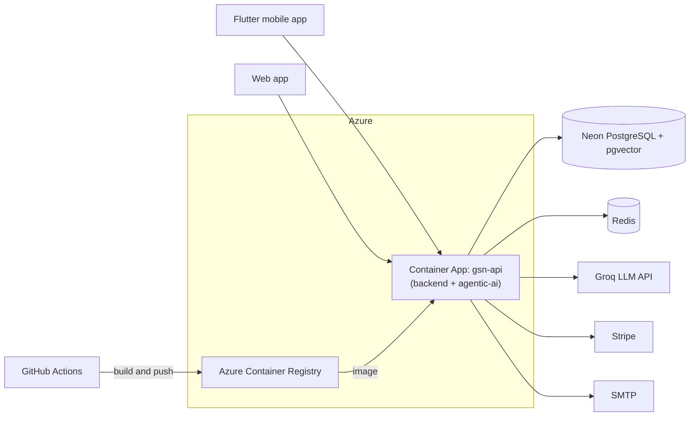

# Hosting the Backend and Agentic AI on Azure

This guide explains how to host the backend API (`backend/`) and the agentic AI layer (`agentic-ai/`) on Azure using **Docker** and **Azure Container Apps**.

## 1. What gets deployed

The backend and the agentic AI are **one application**, not two services.

- `agentic-ai/AgenticAi.csproj` is a class library.
- `backend/src/Government_Service_Navigator.Backend.csproj` references it with a `ProjectReference`.
- `dotnet publish` compiles both into one ASP.NET Core app.

So there is **one Docker image** and **one Container App**. The Docker build must run from the **repo root** so it can see both folders.



## 2. Why Docker + Azure Container Apps

| What the code does | What hosting must provide | How Container Apps covers it |
|---|---|---|
| Targets .NET 10 (`net10.0`) | The .NET 10 runtime | The image carries its own runtime, so there is no wait for Azure platform support |
| Runs `InstallmentMonitorService` and `DataRepairService` as hosted services | The process must stay running | Set **min replicas = 1** so it never scales to zero |
| Serves a SignalR hub (`ApplicationHub`) | WebSockets | Supported by Container Apps ingress by default |
| Runs `Database.Migrate()` on startup | Only one instance migrating at a time | Start with **max replicas = 1** |
| Reads `Data/KnowledgeDocuments/*.md` for RAG ingestion | The files must exist on disk | The Dockerfile copies them into the image |
| Stores uploaded documents and payment slips in the database (`byte[] Content`) | No persistent disk needed | The container can stay stateless |
| Reads all settings from environment variables | Secrets and env vars | Container Apps secrets |

### Alternative without Docker

Azure App Service (code deploy, Linux) also works: publish with `dotnet publish` from GitHub Actions. If you choose it:

- Check that **.NET 10** is offered as a runtime stack in your region.
- Turn on **Always On** (the hosted services stop otherwise) and **Web sockets** (SignalR).
- Make sure `Data/KnowledgeDocuments` ends up in the publish output (see section 9).

Docker is recommended because the same image runs locally, in CI and in Azure, and it does not depend on which runtimes Azure has installed.

## 3. Prerequisites

- An Azure subscription
- Azure CLI installed and logged in: `az login`
- Container Apps extension: `az extension add --name containerapp --upgrade`
- Docker Desktop (only for building and testing locally)
- Your existing Neon `DATABASE_URL` (pooled connection string, host contains `-pooler`)

## 4. Add the Docker files

### 4.1 `Dockerfile` (repo root)

```dockerfile
# ---------- build ----------
FROM mcr.microsoft.com/dotnet/sdk:10.0 AS build
WORKDIR /src

# Restore first so this layer is cached until a .csproj changes
COPY backend/src/Government_Service_Navigator.Backend.csproj backend/src/
COPY agentic-ai/AgenticAi.csproj agentic-ai/
RUN dotnet restore backend/src/Government_Service_Navigator.Backend.csproj

# Copy the source of both projects and publish
COPY backend/ backend/
COPY agentic-ai/ agentic-ai/
RUN dotnet publish backend/src/Government_Service_Navigator.Backend.csproj \
    -c Release -o /app/publish --no-restore /p:UseAppHost=false

# ---------- runtime ----------
FROM mcr.microsoft.com/dotnet/aspnet:10.0 AS runtime
WORKDIR /app

COPY --from=build /app/publish .
# RAG knowledge files are not part of the publish output.
# RagSetupController falls back to <current dir>/Data/KnowledgeDocuments.
COPY backend/src/Data/KnowledgeDocuments ./Data/KnowledgeDocuments

ENV ASPNETCORE_ENVIRONMENT=Production \
    ASPNETCORE_HTTP_PORTS=8080
EXPOSE 8080

# Run as the non-root user that ships with the .NET images
USER $APP_UID
ENTRYPOINT ["dotnet", "Government_Service_Navigator.Backend.dll"]
```

### 4.2 `.dockerignore` (repo root)

Keeps the build context small and stops local secrets from being copied into the image.

```gitignore
**/bin/
**/obj/
**/.env
**/App_Data/
**/node_modules/
.git/
.github/
mobile/
web/
docs/
load/
install/
tui-runner/
*.jpeg
*.png
```

### 4.3 Test the image locally

```bash
docker build -t gsn-api .
docker run --rm -p 8080:8080 --env-file backend/src/.env -e ASPNETCORE_ENVIRONMENT=Production gsn-api
```

Then open `http://localhost:8080`. If the app starts and connects to Neon, the image is ready.

> `Env.Load()` in `Program.cs` does nothing when no `.env` file exists, so in Azure all settings come from environment variables.

## 5. Create the Azure resources (one time)

Pick a region close to your Neon database to keep query latency low. The names below are examples; the registry name must be globally unique and lowercase.

```bash
RG=rg-gsn
LOCATION=southeastasia
ACR=gsnregistry$RANDOM
ENV=gsn-env
APP=gsn-api

# Resource group
az group create --name $RG --location $LOCATION

# Container registry
az acr create --resource-group $RG --name $ACR --sku Basic --admin-enabled true

# Build the image in Azure (no local Docker needed) and push it to the registry
az acr build --registry $ACR --image gsn-api:initial .

# Container Apps environment
az containerapp env create --name $ENV --resource-group $RG --location $LOCATION

# The Container App itself
az containerapp create \
  --name $APP \
  --resource-group $RG \
  --environment $ENV \
  --image $ACR.azurecr.io/gsn-api:initial \
  --registry-server $ACR.azurecr.io \
  --ingress external \
  --target-port 8080 \
  --transport auto \
  --min-replicas 1 \
  --max-replicas 1 \
  --cpu 0.5 --memory 1.0Gi
```

Get the public URL:

```bash
az containerapp show --name $APP --resource-group $RG --query properties.configuration.ingress.fqdn -o tsv
```

## 6. Configure secrets and environment variables

Values that are sensitive go in as **secrets**, then environment variables point at them with `secretref:`.

### 6.1 Secrets

```bash
az containerapp secret set --name $APP --resource-group $RG --secrets \
  database-url="<neon pooled connection string>" \
  jwt-key="<long random string, at least 32 characters>" \
  stripe-secret-key="sk_live_or_test_..." \
  groq-api-key="<groq key>" \
  smtp-password="<smtp app password>" \
  redis-url="<host:6380,password=...,ssl=True,abortConnect=False>"
```

### 6.2 Environment variables

```bash
az containerapp update --name $APP --resource-group $RG --set-env-vars \
  ASPNETCORE_ENVIRONMENT=Production \
  DATABASE_URL=secretref:database-url \
  DB_MAX_POOL_SIZE=50 \
  JWT_KEY=secretref:jwt-key \
  JWT_ISSUER=GovServiceNavigator \
  JWT_AUDIENCE=GovServiceNavigatorClients \
  JWT_EXPIRY_HOURS=24 \
  STRIPE_SECRET_KEY=secretref:stripe-secret-key \
  GROQ_API_KEY=secretref:groq-api-key \
  GROQ_MODEL=<model name> \
  SMTP_HOST=smtp.gmail.com \
  SMTP_PORT=587 \
  SMTP_USER=<smtp user> \
  SMTP_PASSWORD=secretref:smtp-password \
  SMTP_FROM_EMAIL=<from address> \
  "SMTP_FROM_NAME=Government Service Navigator" \
  SMTP_USE_SSL=true \
  RATE_LIMIT_PER_MINUTE=120 \
  REDIS_URL=secretref:redis-url \
  BANK_NAME=<bank> \
  BANK_BRANCH=<branch> \
  BANK_ACCOUNT_NAME=<account name> \
  BANK_ACCOUNT_NUMBER=<account number>
```

### 6.3 Full variable list

| Variable | Secret? | Notes |
|---|---|---|
| `DATABASE_URL` | Yes | Neon pooled connection string. When set, `DB_HOST`/`DB_PORT`/`DB_NAME`/`DB_USER`/`DB_PASSWORD` are not needed |
| `DB_MAX_POOL_SIZE` | No | Npgsql pool cap per replica |
| `JWT_KEY` | Yes | Generate a new random key for production; do not reuse the local one |
| `JWT_ISSUER`, `JWT_AUDIENCE`, `JWT_EXPIRY_HOURS` | No | Same values the apps expect |
| `STRIPE_SECRET_KEY` | Yes | Use the live key only when going live |
| `GROQ_API_KEY` | Yes | Used by the agentic AI layer |
| `GROQ_MODEL` | No | LLM model name |
| `SMTP_HOST`, `SMTP_PORT`, `SMTP_USER`, `SMTP_FROM_EMAIL`, `SMTP_FROM_NAME`, `SMTP_USE_SSL` | No | Email notifications |
| `SMTP_PASSWORD` | Yes | Gmail app password or provider key |
| `REDIS_URL` | Yes | Optional. Leave unset to use the in-memory cache (fine with one replica) |
| `RATE_LIMIT_PER_MINUTE` | No | Requests per user per minute before 429 |
| `BANK_NAME`, `BANK_BRANCH`, `BANK_ACCOUNT_NAME`, `BANK_ACCOUNT_NUMBER` | No | Shown for manual bank transfer payments |

### 6.4 Redis options

Redis is optional while you run one replica. When you need it:

- **Azure Cache for Redis** (Basic C0 is enough to start), same region as the app, or
- **Upstash** (serverless, pay per request): `your-host.upstash.io:6379,password=xxxx,ssl=True,abortConnect=False`

## 7. Automatic deploys with GitHub Actions

### 7.1 Create a service principal for GitHub

```bash
az ad sp create-for-rbac \
  --name gsn-github-deploy \
  --role contributor \
  --scopes /subscriptions/<subscription-id>/resourceGroups/rg-gsn \
  --json-auth
```

Save the JSON output as a GitHub repository secret named **`AZURE_CREDENTIALS`**. Also add these repository **variables**: `ACR_NAME`, `AZURE_RG` (`rg-gsn`) and `CONTAINER_APP` (`gsn-api`).

Give the service principal permission to push images:

```bash
ACR_ID=$(az acr show --name $ACR --query id -o tsv)
SP_ID=$(az ad sp list --display-name gsn-github-deploy --query "[0].appId" -o tsv)
az role assignment create --assignee $SP_ID --role AcrPush --scope $ACR_ID
```

### 7.2 Workflow: `.github/workflows/deploy-azure.yml`

```yaml
name: Deploy API to Azure

on:
  push:
    branches: [ "main" ]
    paths:
      - "backend/**"
      - "agentic-ai/**"
      - "Dockerfile"
      - ".dockerignore"
      - ".github/workflows/deploy-azure.yml"
  workflow_dispatch:

concurrency:
  group: deploy-azure
  cancel-in-progress: false

jobs:
  deploy:
    name: Build and deploy
    runs-on: ubuntu-latest

    steps:
      - name: Checkout
        uses: actions/checkout@v4

      - name: Azure login
        uses: azure/login@v2
        with:
          creds: ${{ secrets.AZURE_CREDENTIALS }}

      # Builds the Dockerfile inside Azure and pushes it to the registry
      - name: Build and push image
        run: |
          az acr build \
            --registry ${{ vars.ACR_NAME }} \
            --image gsn-api:${{ github.sha }} \
            --image gsn-api:latest \
            .

      - name: Deploy new image
        run: |
          az containerapp update \
            --name ${{ vars.CONTAINER_APP }} \
            --resource-group ${{ vars.AZURE_RG }} \
            --image ${{ vars.ACR_NAME }}.azurecr.io/gsn-api:${{ github.sha }}
```

Each push to `main` that touches the backend or agentic AI builds a new image tagged with the commit SHA and rolls the Container App to it. To roll back, run `az containerapp update` with an older SHA tag.

## 8. Point the clients at Azure

Replace the local API base URL in the mobile and web apps with the Container App URL from section 5:

```
https://gsn-api.<random>.<region>.azurecontainerapps.io
```

SignalR clients connect to the same host (`ApplicationHub.Path`). Container Apps serves HTTPS on port 443 and forwards to port 8080 inside the container, so no port is needed in the URL.

## 9. Things to fix or watch

1. **Test packages in `AgenticAi.csproj`.** It references `xunit`, `xunit.runner.visualstudio`, `Microsoft.NET.Test.Sdk` and `coverlet.collector`, and those flow into the published backend. Move them into a separate test project (for example `agentic-ai/tests/AgenticAi.Tests.csproj`) so the production image stays small.
2. **Scaling past one replica.** Before raising `--max-replicas` above 1:
   - Set `REDIS_URL` so the cache, token revocation and SignalR backplane are shared.
   - Enable sticky sessions for SignalR: `az containerapp ingress sticky-sessions set --name $APP --resource-group $RG --affinity sticky`.
   - Make sure `InstallmentMonitorService` and `DataRepairService` are safe to run on every replica at once, or move them into a separate single-replica job.
   - Move `Database.Migrate()` out of startup into a deploy step so replicas do not migrate at the same time.
3. **CORS.** The API currently allows any origin (`AllowAllOrigins`). For production, restrict it to your web app domain.
4. **Swagger** is only enabled in `Development`, so it is off in Azure. This is intended.
5. **Stripe webhooks.** If you add webhooks later, point them at `https://<app url>/...` and store the signing secret as a Container Apps secret.
6. **Logs.** View live logs with:

   ```bash
   az containerapp logs show --name $APP --resource-group $RG --follow
   ```

7. **Cost.** With `--min-replicas 1` the app is always running, so it is billed continuously. That is required for the background services and SignalR.

## 10. Checklist

- [ ] `Dockerfile` and `.dockerignore` added at the repo root
- [ ] Image builds and runs locally with `docker run`
- [ ] Resource group, ACR, Container Apps environment and Container App created
- [ ] Secrets and environment variables set
- [ ] App URL responds and connects to Neon
- [ ] `AZURE_CREDENTIALS` secret and `ACR_NAME`, `AZURE_RG`, `CONTAINER_APP` variables added to GitHub
- [ ] `deploy-azure.yml` workflow added and first deploy succeeded
- [ ] Mobile and web apps updated to the Azure URL
