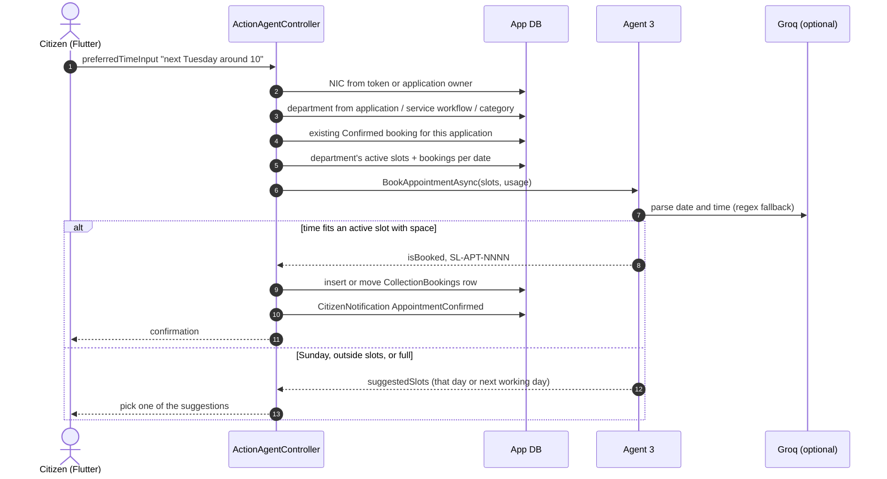
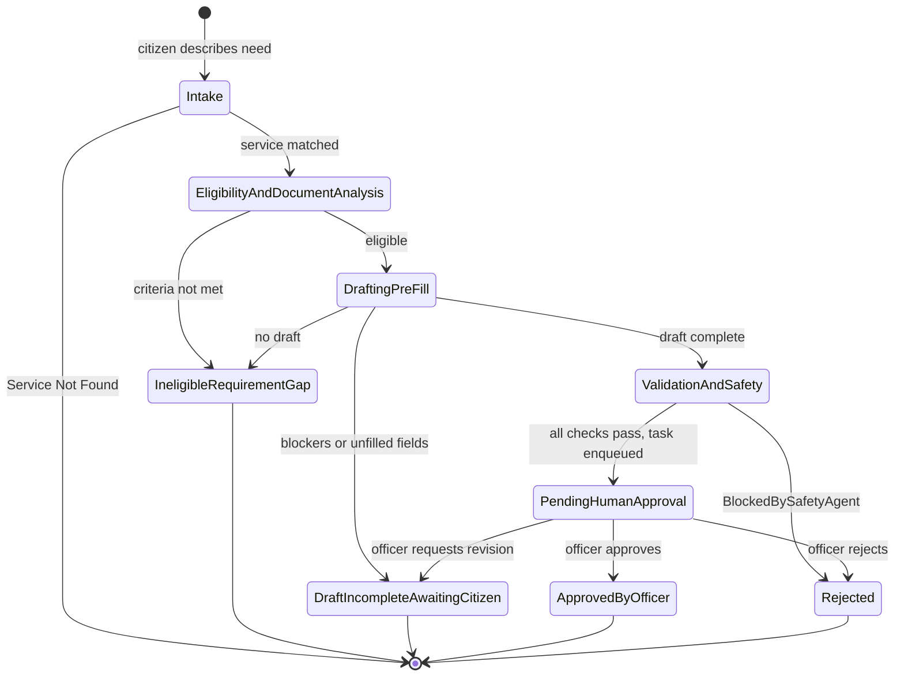
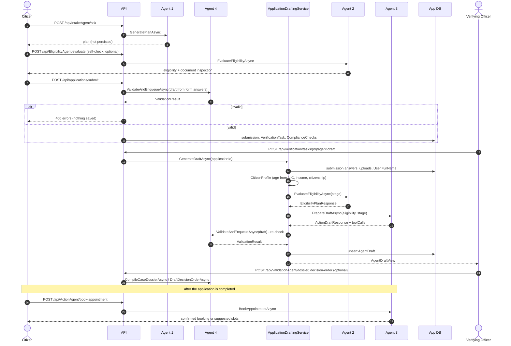

# Agentic AI Subsystem Architecture

The "Navigator Agent Workflow" from `docs/Government_Service_Navigator_Project_Plan.md` §2, as implemented in `agentic-ai/` and wired into the backend.

Objective given to the system: *"Help this citizen complete [X] procedure."*

Key properties (rationale in `docs/adr/0008-deterministic-in-process-agents.md` and `docs/adr/0015-groq-llm-over-deterministic-agents.md`):

- **In-process.** `agentic-ai/AgenticAi.csproj` is a class library referenced by the backend. The agents, tools and orchestrators are DI-registered in `backend/src/Program.cs`; there is no separate agent service.
- **Deterministic tools, LLM reasoning on top.** Every tool reads the relational catalog or applies fixed rules. When `GROQ_API_KEY` is set, each agent also sends the tool results and retrieved policy text to the Groq LLM (`GroqLlmService`, default model `openai/gpt-oss-120b`) for the judgement or the wording. With no key, or when the call fails, each agent returns its deterministic answer.
- **Local RAG.** `LocalEmbeddingService` hashes keywords into 768-d vectors. These are stored in a separate pgvector database (`KnowledgeChunks`, HNSW cosine index). Only text generation uses the network, never embedding.
- **A human commits, with one exception.** Agents produce plans, drafts, briefings and validation results, and only a Verifying Officer approves an application (`docs/diagrams/human-in-the-loop-workflow.md`). The exception is Agent 3's appointment booking, which confirms a collection slot without an officer.

## Component diagram

```mermaid
graph TB
    subgraph Callers["Backend entry points"]
        E1["IntakeAgentController<br/>POST /api/IntakeAgent/ask"]
        E2["EligibilityAgentController<br/>POST evaluate / orchestrate"]
        E3["ActionAgentController<br/>POST draft / orchestrate /<br/>book-appointment"]
        E6["ValidationAgentController<br/>validate / orchestrate / briefing /<br/>dossier / decision-order /<br/>remediation-notice / golden-cases"]
        E4["ApplicationsController<br/>submit / submit-stage"]
        E5["VerificationController<br/>POST tasks/{id}/agent-draft"]
        DS["ApplicationDraftingService<br/>builds CitizenProfile from submission"]
        RAG["RagSetupController<br/>seed / seed-action-agent /<br/>upload-policy / ingest-local-documents"]
    end

    subgraph Orch["orchestration/"]
        O2["Agent2WorkflowOrchestrator"]
        O3["Agent3WorkflowOrchestrator"]
        O4["ValidationOrchestrator"]
        ST["state/ WorkflowExecutionState<br/>(in-memory, returned to caller)"]
    end

    subgraph Agents["agents/"]
        A1["01 Intake and Planning<br/>IntakePlanningAgent"]
        A2["02 Eligibility and Document<br/>EligibilityDocumentAgent"]
        A3["03 Action / Tool<br/>ActionToolAgent"]
        A4["04 Validation and Safety<br/>ValidationSafetyAgent"]
    end

    subgraph Tools["tools/"]
        T1["check_eligibility_rules"]
        T2["get_document_requirements<br/>(stage-aware)"]
        T3["prefill_application"]
        T4["calculate_fee"]
        T5["find_appointment_slot"]
        T6["validate_schema"]
        T7["check_duplicate_application<br/>+ static in-memory registry"]
    end

    subgraph Svc["services/"]
        LLM["GroqLlmService : ILlmService<br/>optional, JSON mode, 30 s timeout"]
    end

    subgraph Retrieval["Retrieval (backend/src/Services)"]
        EMB["LocalEmbeddingService<br/>FNV-1a hashed unigrams + bigrams"]
        R1["VectorRetrieverService"]
        R2["EligibilityVectorRetrieverService"]
        R3["ActionVectorRetrieverService"]
    end

    subgraph Adapters["Backend adapters (interfaces owned by agentic-ai)"]
        REPO["ActionToolRepositories<br/>fees, templates, documents"]
        DUPR["DuplicateApplicationRepository"]
        ENQ["VerificationTaskEnqueuerService"]
    end

    APPDB[("App DB<br/>ServiceProcedures, EligibilityRules,<br/>DocumentRequirements, FeeSchedules,<br/>Templates, ApplicationSubmissions,<br/>VerificationTasks, AgentDrafts,<br/>CollectionTimeSlots, CollectionBookings")]
    VDB[("Vector DB<br/>KnowledgeChunks vector(768)")]
    GROQ["Groq API"]

    E1 --> A1
    E2 --> A2
    E2 --> O2 --> A2
    E3 --> A3
    E3 --> O3 --> A3
    E3 -- "slots and bookings (raw SQL)" --> APPDB
    E4 --> A4
    E6 --> A4
    E6 --> O4 --> A4
    E5 --> DS
    DS --> A2
    DS --> A3
    DS --> A4
    O2 -.-> ST
    O3 -.-> ST
    O4 -.-> ST

    A1 --> EMB
    A1 --> R1
    A2 --> EMB
    A2 --> R2
    A2 --> T1
    A2 --> T2
    A3 --> EMB
    A3 --> R3
    A3 --> T3
    A3 --> T4
    A3 --> T5
    A4 --> T6
    A4 --> T7
    A4 --> ENQ
    A1 & A2 & A3 & A4 -. "if GROQ_API_KEY" .-> LLM
    LLM --> GROQ

    R1 --> VDB
    R2 --> VDB
    R3 --> VDB
    RAG --> EMB
    RAG --> VDB

    T1 --> APPDB
    T2 --> REPO
    T3 --> REPO
    T4 --> REPO
    REPO --> APPDB
    T7 --> DUPR --> APPDB
    ENQ --> APPDB
    DS --> APPDB
```

The dependency direction is deliberate: `agentic-ai` defines interfaces such as `IDuplicateApplicationRepository`, `IVerificationTaskEnqueuer`, `IFeeScheduleRepository`, `IEmbeddingService` and `ILlmService`, and the backend implements or registers them. The agent library therefore never references `AppDbContext`, and the xUnit tests in `agentic-ai/tests/` run with fakes, including a stub LLM.

## The four agents

| # | Agent | Input → Output | Tools / retrieval | With the LLM | Safe failure |
|---|---|---|---|---|---|
| 1 | **Intake & Planning** (`IntakePlanningAgent`) | `IntakePlanRequest(text)` → `IntakePlanResponse(recommendedService, requiredDocuments, stepByStepPlan, retrievedContextSnippets)` | Embed the query → top 8 chunks (`VectorRetrieverService`) | Writes the whole plan, grounded in the 8 chunks: the exact service name from the chunk header, a step naming the documents to prepare, and only the fees the context states. Otherwise `"Service Not Found"`, pointing to the service catalog or the Divisional Secretariat. `IntakeAgentController` then snaps the service name to the live catalog and merges in the catalog's document requirements | No LLM: keeps the first chunk that **shares a keyword** with the query, else `"Service Not Found"` with the list of the five services that have knowledge documents |
| 2 | **Eligibility & Document Analysis** (`EligibilityDocumentAgent`) | `EligibilityPlanRequest(serviceName, serviceId, CitizenProfile, planSummary, stage)` → `EligibilityPlanResponse(isEligible, matchPercentage, missingCriteria, requiredDocuments, missingDocuments, reasoning, snippets)` | `check_eligibility_rules` (age / citizenship), `get_document_requirements` (per stage when `stage` is set), top 8 eligibility chunks | Decides eligibility and missing documents from the tool baseline, the policy text and the upload names, audited only against this stage's required documents. Flags an upload as suspicious when its file name suggests something unrelated (a diagram, screenshot, packaging label), even in the right slot, and notes generic names like `IMG_001.jpg` for officer inspection. A code guardrail then removes from `missingDocuments` anything that matches an upload | No LLM: rule result + catalog documents. Vector DB down → falls back to the tool |
| 3 | **Action / Tool** (`ActionToolAgent`) | `ActionDraftRequest(applicant, eligibility, providedDocuments, preferredDate, express, stage)` → `ActionDraftResponse(isReadyForValidation, draft, fee, appointment, unfilledRequiredFields, blockers, notesForOfficer, reasoning, toolCalls, snippets)` | `prefill_application` (template fields ← citizen answers), `calculate_fee` (express fees only if requested), `find_appointment_slot` (Mon-Fri 09:00-15:00 SLT, 30 min, ≥ 2 working days), top 5 fee/form/policy chunks | Rewrites `reasoning` and adds officer notes. Draft, fee and slot are unchanged | Never drafts for an ineligible citizen (`draft: null`), but still returns the stage fee so the officer sees it. Any blocker → `isReadyForValidation: false` |
| 4 | **Validation & Safety** (`ValidationSafetyAgent`) | `DraftApplication` + required documents → `ValidationResult(isValid, decision, summary, riskLevel, officerBriefing, complianceChecks, rejectionReasons, toolCalls, verificationTaskId)` | `validate_schema` (NIC format, age 16-125, mandatory documents - a document also counts when a non-empty answer has a matching label - and injection keywords), `check_duplicate_application` (in-memory registry checked against the DB), fee ≥ 0, PII filter (masks card numbers and passwords) | Gets the stage, total stages, department and `RequiredDocumentsForStage`. Adds a risk level, a structured officer briefing (identity, stage documents, compliance, recommended action) and "semantic consistency" flags. Flags that survive a code filter become `INCONSISTENCY-FLAG` rejection reasons | Any deterministic violation, or any surviving LLM flag → `Rejected`, halted **before** the officer queue. The LLM can't overturn a deterministic failure. Duplicates are recorded as a check but don't reject (`BlockDuplicateSubmissions = false`) |

Agents 3 and 4 log every tool call (`ToolCallRecord` / `ValidationToolCall`: tool name, input, output, time). The log is stored with the draft and shown to the officer, so the reasoning is persisted rather than hidden. Agent 4 logs the LLM audit as a tool call too (`ai_cognitive_safety_audit`).

**Stage scoping.** When the officer generates a draft, `ApplicationDraftingService` passes Agents 2 and 4 only the uploads whose label matches a file field of the current stage's template (all uploads for a single-stage or older application). The fee given to Agent 4 is Agent 3's stage fee, or the latest payment's amount when that is zero.

The `search-service-catalog` tool folder from the plan contains only a README. Agent 1 does its catalog search directly through `IVectorRetriever`.

## Agent 4's officer actions

Besides validating, Agent 4 prepares three documents for the officer, exposed under `api/ValidationAgent` and used from the verification workspace's agent panel (`web/src/Officer/AgentDraftPanel.tsx`):

| Action | What it produces | LLM? |
|---|---|---|
| `CompileCaseDossierAsync` (`POST dossier`) | Re-runs validation, then a risk score (5-98), a queue tier (Fast-Track below 30, Standard up to 60, Senior Regulatory Compliance above) and a SHA-256 "integrity seal" over the key fields | Only through the validation it re-runs |
| `DraftDecisionOrderAsync` (`POST decision-order`) | A formal approval, revision or rejection order: title, statutory basis, findings, conditions, sign-off text | Yes, with a fixed template as fallback |
| `DraftRemediationNoticeAsync` (`POST remediation-notice`) | A notice listing the defects, with a 7-day hold date | No |

None of these changes an application. The officer still decides through `PUT tasks/{id}/decision` or `approve-stage`; the workspace can copy a decision order into that decision.

## Appointment booking (Agent 3)

When an application is approved or completed, the mobile app's **Completed Services & Bookings** screen offers two options: book a time to collect the result in person, or request postal delivery. The postal request is kept only in the app (`post_service_form_screen.dart` calls no API). In-person booking calls `POST /api/ActionAgent/book-appointment`, which runs this flow:

- Slots and holidays are managed by the department admin (`api/admin/collection-slots`, web page **Collection Slots**). A slot repeats weekly unless it has a specific date.
- If the department has no slots at all, any time from 09:00 to 15:30 except Sunday is accepted, with no capacity check.
- Declared holidays are shown on the admin timeline but aren't checked when booking.

## Pipeline and state machine

The orchestrators move a `WorkflowExecutionState` through named stages:

`HumanApprovalStatus` runs alongside the stages: `NotReady` → `AwaitingOfficerReview` → `Approved` / `Rejected` / `Revised`, or `BlockedBySafetyAgent`.

**This state machine is a model, not a table.** The orchestrators set the transitions from `EligibilityAndDocumentAnalysis` through `PendingHumanApproval`/`Rejected`. `Intake` and the transitions out of `PendingHumanApproval` are only named in `WorkflowExecutionState`'s comments; no code sets them. An officer's decision updates `VerificationTask`, not this state. `WorkflowExecutionState` exists only in memory and is returned by the `/orchestrate` endpoints. The persisted record of a run is spread across these tables:

| What | Where it's persisted |
|---|---|
| Plan (Agent 1) | Not persisted - returned to the Flutter app only |
| Eligibility + draft + tool calls + validation (Agents 2-4, officer-triggered) | `AgentDrafts.DraftJson` (one per application, overwritten on regenerate) |
| Agent 4 compliance checks at submit | `ComplianceChecks` rows on the verification task |
| Dossier, decision order, remediation notice | Not persisted - returned to the web panel only |
| Appointment booking (Agent 3) | `CollectionBookings` (status, date, slot, confirmation code, agent reasoning) |
| Approval decision | `VerificationTasks.Status`, `OfficerReviews`, `AuditLogs` |
| Final outcome | `ApplicationSubmissions.StageStatus` |

The plan's `WorkflowExecutions` table was never created.

## When each agent runs in production flow

At submit time, Agent 4 validates a draft built directly from the citizen's form answers, without running Agents 2 and 3 first. Agents 2 and 3 run later, and only when the officer asks. So the pipeline's order at runtime is 1 → (2 as a self-check) → 4 → (officer) → 2 → 3 → 4, not 1 → 2 → 3 → 4. The `/orchestrate` endpoints run individual stages in the planned order for demos and evaluation.

## Knowledge base (RAG) layout

| `SourceCategory` | Content | Seeded by | Read by |
|---|---|---|---|
| Service category (e.g. `Transport & Travel`) | One chunk per live service: name, category, documents, fees | `POST /api/RagSetup/seed` | Agent 1, Agent 2 |
| `Service:{id}:{code}` | Policy / statute paragraphs for one service | `upload-policy`, `ingest-local-documents` (`Data/KnowledgeDocuments/*.md`) | Agent 2 (and Agent 1 through its top-8 search) |
| `ActionTool:*` | Fee schedules, active form templates, appointment policy | `POST /api/RagSetup/seed-action-agent` | Agent 3 |

Chunks are text snapshots. After catalog, template or embedding changes, re-run the seed endpoints. Nothing triggers them automatically.

## Configuration

| Setting | Where | Value |
|---|---|---|
| LLM | `GROQ_API_KEY`, `GROQ_MODEL` (or `Groq:ApiKey`, `Groq:Model`) | Optional. Default model `openai/gpt-oss-120b`, temperature 0.2, 30 s timeout |
| Agent 4 | `ValidationSafetyConfig` singleton in `Program.cs` | `BlockDuplicateSubmissions = false` (duplicates are flagged for the officer, not rejected), `MinimumLegalAge = 16`, `EnableAdversarialDefense = true`. Hardcoded, not read from `.env`. The age bound actually applied is also hardcoded in `SchemaValidatorTool` (16-125) |

`GET /api/ValidationAgent/status` reports whether the LLM is configured and which model is in use.

## Evaluation

The xUnit suites in `agentic-ai/tests/` use fakes for the repositories and the vector retriever, and a stub `ILlmService`, so they never call Groq:
- `IntakeAndEligibilityAgentTests` - 7 tests
- `ActionToolAgentTests` - 8 tests
- `ValidationSafetyAgentTests` - 9 tests, including one that checks the LLM risk level and briefing are used

`GET /api/ValidationAgent/evaluation/golden-cases` runs four scenarios against the live Agent 4: a valid application, a malformed NIC, a missing required document and a prompt injection. `tests/golden-cases/` still holds only a README. The `agentic-ai.yml` workflow runs the build and a scaffold-structure check on changes under `agentic-ai/`.

## Known gaps

- **Validating from the officer side can reopen a task.** Generating a draft, compiling a dossier, and the `validate`, `orchestrate` and `briefing` endpoints all call `ValidateAndEnqueueAsync`. When it passes, `VerificationTaskEnqueuerService` calls `CreateTaskAsync`, which reuses the application's existing task and sets its status back to `Pending`, even if the officer already decided it.
- **Bookings are confirmed without an officer**, don't check declared holidays, and return a fixed placeholder contact and address for every department.
- **The LLM can now block a submission.** Agent 4's consistency flags used to be advisory. Any flag the code filter doesn't recognise is now a rejection reason, so a model mistake returns `400` to the citizen. The filter is a list of keywords (`department`, `payment`, `slip`, `extra`, `ambiguous` and so on), so it also drops a genuine flag that happens to use one of them.
- **Duplicate detection only flags.** With `BlockDuplicateSubmissions = false`, a citizen can submit the same service twice; the officer sees the duplicate check fail in the compliance list. The in-memory registry is now checked against the database on every call, so a finished application no longer blocks a new one until a restart.
- **The LLM's eligibility verdict isn't checked against the rule tool.** The prompt says a missing mandatory document means not eligible, but code doesn't enforce agreement (ADR-0015).
- **Citizen data is sent to Groq** when the key is set: names, NICs, ages, income, form answers and document file names.
- **Agent 1's no-LLM fallback lists five hardcoded services** (the ones with knowledge documents). The LLM prompt no longer lists them.
- **Agent 1's catalog matching is loose.** `IntakeAgentController` accepts a catalog service when either name contains the other, so a short service name can capture an unrelated recommendation.
- **The agent endpoints, including `ValidationAgent`, and `RagSetup` are unauthenticated** (`docs/api.md`).
- **Retrieval is keyword overlap.** Synonyms with no shared token don't match. With the LLM on, all 8 retrieved chunks are passed to it, which helps only when the right chunk is among them.
- `agentic-ai/README.md` still describes the pre-implementation scaffold.
