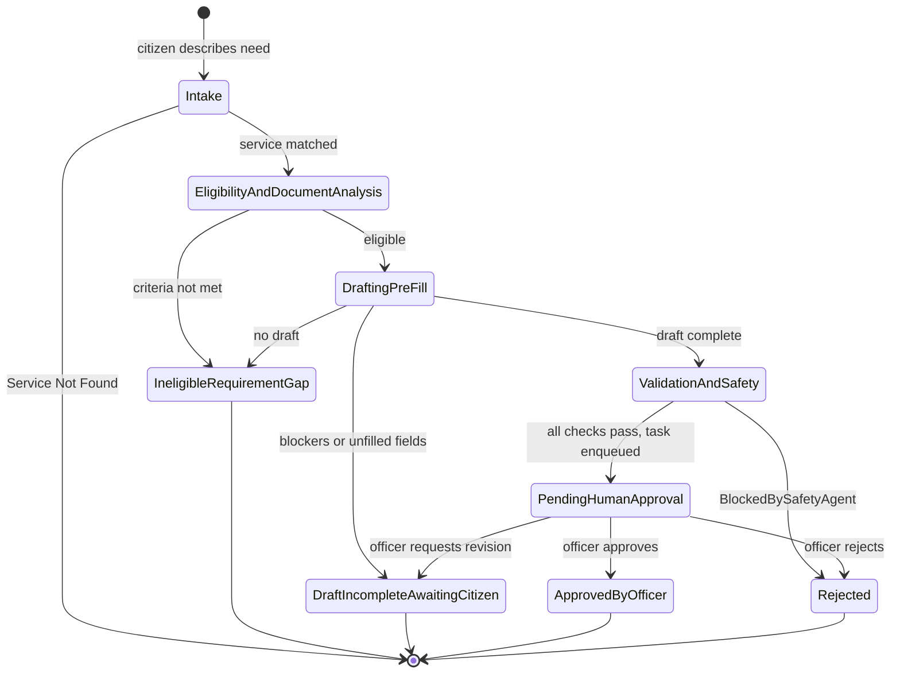
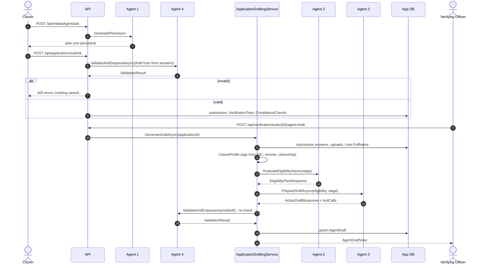

# Agentic AI Subsystem Architecture

The "Navigator Agent Workflow" from `docs/Government_Service_Navigator_Project_Plan.md` §2, as implemented in `agentic-ai/` and wired into the backend, as of 2026-09-27.

Objective given to the system: *"Help this citizen complete [X] procedure."*

Key properties (rationale in `docs/adr/0008-deterministic-in-process-agents.md`):

- **In-process.** `agentic-ai/AgenticAi.csproj` is a class library referenced by the backend. The agents, tools and orchestrators are DI-registered in `backend/src/Program.cs`; there is no separate agent service.
- **Deterministic.** No LLM is called. Decisions come from allow-listed tools that read the relational catalog, and the vector DB supplies supporting context.
- **Local RAG.** `LocalEmbeddingService` hashes keywords into 768-d vectors. These are stored in a separate pgvector database (`KnowledgeChunks`, HNSW cosine index).
- **A human commits.** Agents produce plans, drafts and validation results. Only a Verifying Officer approves (`docs/diagrams/human-in-the-loop-workflow.md`).

## Component diagram

```mermaid
graph TB
    subgraph Callers["Backend entry points"]
        E1["IntakeAgentController<br/>POST /api/IntakeAgent/ask"]
        E2["EligibilityAgentController<br/>POST evaluate / orchestrate"]
        E3["ActionAgentController<br/>POST draft / orchestrate"]
        E4["ApplicationsController<br/>submit / submit-stage"]
        E5["VerificationController<br/>POST tasks/{id}/agent-draft"]
        DS["ApplicationDraftingService<br/>builds CitizenProfile from submission"]
        RAG["RagSetupController<br/>seed / seed-action-agent /<br/>upload-policy / ingest-local-documents"]
    end

    subgraph Orch["orchestration/"]
        O2["Agent2WorkflowOrchestrator"]
        O3["Agent3WorkflowOrchestrator"]
        O4["ValidationOrchestrator"]
        ST["state/ WorkflowExecutionState<br/>(in-memory, returned to caller)"]
    end

    subgraph Agents["agents/"]
        A1["01 Intake and Planning<br/>IntakePlanningAgent"]
        A2["02 Eligibility and Document<br/>EligibilityDocumentAgent"]
        A3["03 Action / Tool<br/>ActionToolAgent"]
        A4["04 Validation and Safety<br/>ValidationSafetyAgent"]
    end

    subgraph Tools["tools/"]
        T1["check_eligibility_rules"]
        T2["get_document_requirements<br/>(stage-aware)"]
        T3["prefill_application"]
        T4["calculate_fee"]
        T5["find_appointment_slot"]
        T6["validate_schema"]
        T7["check_duplicate_application<br/>+ static in-memory registry"]
    end

    subgraph Retrieval["Retrieval (backend/src/Services)"]
        EMB["LocalEmbeddingService<br/>FNV-1a hashed unigrams + bigrams"]
        R1["VectorRetrieverService"]
        R2["EligibilityVectorRetrieverService"]
        R3["ActionVectorRetrieverService"]
    end

    subgraph Adapters["Backend adapters (interfaces owned by agentic-ai)"]
        REPO["ActionToolRepositories<br/>fees, templates, documents"]
        DUPR["DuplicateApplicationRepository"]
        ENQ["VerificationTaskEnqueuerService"]
    end

    APPDB[("App DB<br/>ServiceProcedures, EligibilityRules,<br/>DocumentRequirements, FeeSchedules,<br/>Templates, ApplicationSubmissions,<br/>VerificationTasks, AgentDrafts")]
    VDB[("Vector DB<br/>KnowledgeChunks vector(768)")]

    E1 --> A1
    E2 --> A2
    E2 --> O2 --> A2
    E3 --> A3
    E3 --> O3 --> A3
    E4 --> A4
    O4 --> A4
    E5 --> DS
    DS --> A2
    DS --> A3
    DS --> A4
    O2 -.-> ST
    O3 -.-> ST
    O4 -.-> ST

    A1 --> EMB
    A1 --> R1
    A2 --> EMB
    A2 --> R2
    A2 --> T1
    A2 --> T2
    A3 --> EMB
    A3 --> R3
    A3 --> T3
    A3 --> T4
    A3 --> T5
    A4 --> T6
    A4 --> T7
    A4 --> ENQ

    R1 --> VDB
    R2 --> VDB
    R3 --> VDB
    RAG --> EMB
    RAG --> VDB

    T1 --> APPDB
    T2 --> REPO
    T3 --> REPO
    T4 --> REPO
    REPO --> APPDB
    T7 --> DUPR --> APPDB
    ENQ --> APPDB
    DS --> APPDB
```

The dependency direction is deliberate: `agentic-ai` defines interfaces such as `IDuplicateApplicationRepository`, `IVerificationTaskEnqueuer`, `IFeeScheduleRepository` and `IEmbeddingService`, and the backend implements them. The agent library therefore never references `AppDbContext`, and the xUnit tests in `agentic-ai/tests/` run with fakes.

## The four agents

| # | Agent | Input → Output | Tools / retrieval | Safe failure |
|---|---|---|---|---|
| 1 | **Intake & Planning** (`IntakePlanningAgent`) | `IntakePlanRequest(text)` → `IntakePlanResponse(recommendedService, requiredDocuments, stepByStepPlan, retrievedContextSnippets)` | Embed the query → top 3 catalog chunks (`VectorRetrieverService`) → keep the first chunk that **shares a keyword** with the query | No shared keyword → `"Service Not Found"` + "contact the main helpdesk" |
| 2 | **Eligibility & Document Analysis** (`EligibilityDocumentAgent`) | `EligibilityPlanRequest(serviceName, serviceId, CitizenProfile, planSummary, stage)` → `EligibilityPlanResponse(isEligible, matchPercentage, missingCriteria, requiredDocuments, missingDocuments, reasoning, snippets)` | `check_eligibility_rules` (age / citizenship), `get_document_requirements` (per stage when `stage` is set), eligibility chunks from the vector DB | Criteria not met → `isEligible: false` with `missingCriteria`. Unmatched documents are flagged for the officer, not blocking. Vector DB down → falls back to the tool |
| 3 | **Action / Tool** (`ActionToolAgent`) | `ActionDraftRequest(applicant, eligibility, providedDocuments, preferredDate, express, stage)` → `ActionDraftResponse(isReadyForValidation, draft, fee, appointment, unfilledRequiredFields, blockers, notesForOfficer, reasoning, toolCalls, snippets)` | `prefill_application` (template fields ← citizen answers), `calculate_fee` (express fees only if requested), `find_appointment_slot` (Mon-Fri 09:00-15:00 SLT, 30 min, ≥ 2 working days), fee/form/policy chunks | Never drafts for an ineligible citizen (`draft: null`). Any blocker → `isReadyForValidation: false` |
| 4 | **Validation & Safety** (`ValidationSafetyAgent`) | `DraftApplication` + required documents → `ValidationResult(isValid, decision, summary, complianceChecks, rejectionReasons, verificationTaskId)` | `validate_schema` (NIC format, age 16-125, mandatory documents, injection keywords), `check_duplicate_application` (in-memory registry + DB), fee ≥ 0 | Any violation → `Rejected`, halted **before** the officer queue |

Every tool call Agent 3 makes is logged as a `ToolCallRecord(toolName, input, output, calledAt)`. The log is stored with the draft and shown to the officer, so the reasoning is persisted rather than hidden.

The `search-service-catalog` tool folder from the plan contains only a README. Agent 1 does its catalog search directly through `IVectorRetriever`.

## Pipeline and state machine

The orchestrators move a `WorkflowExecutionState` through named stages:

`HumanApprovalStatus` runs alongside the stages: `NotReady` → `AwaitingOfficerReview` → `Approved` / `Rejected` / `Revised`, or `BlockedBySafetyAgent`.

**This state machine is a model, not a table.** The orchestrators set the transitions from `EligibilityAndDocumentAnalysis` through `PendingHumanApproval`/`Rejected`. `Intake` and the transitions out of `PendingHumanApproval` are only named in `WorkflowExecutionState`'s comments; no code sets them. An officer's decision updates `VerificationTask`, not this state. `WorkflowExecutionState` exists only in memory and is returned by the `/orchestrate` endpoints. The persisted record of a run is spread across these tables:

| What | Where it's persisted |
|---|---|
| Plan (Agent 1) | Not persisted - returned to the Flutter app only |
| Eligibility + draft + tool calls + validation (Agents 2-4, officer-triggered) | `AgentDrafts.DraftJson` (one per application, overwritten on regenerate) |
| Agent 4 compliance checks at submit | `ComplianceChecks` rows on the verification task |
| Approval decision | `VerificationTasks.Status`, `OfficerReviews`, `AuditLogs` |
| Final outcome | `ApplicationSubmissions.StageStatus` |

The plan's `WorkflowExecutions` table was never created.

## When each agent runs in production flow

At submit time, Agent 4 validates a draft built directly from the citizen's form answers, without running Agents 2 and 3 first. Agents 2 and 3 run later, and only when the officer asks. So the pipeline's order at runtime is 1 → 4 → (officer) → 2 → 3 → 4, not 1 → 2 → 3 → 4. The `/orchestrate` endpoints run individual stages in the planned order for demos and evaluation.

## Knowledge base (RAG) layout

| `SourceCategory` | Content | Seeded by | Read by |
|---|---|---|---|
| Service category (e.g. `Immigration`) | One chunk per live service: name, category, documents, fees | `POST /api/RagSetup/seed` | Agent 1, Agent 2 |
| `Service:{id}:{code}` | Policy / statute paragraphs for one service | `upload-policy`, `ingest-local-documents` (`Data/KnowledgeDocuments/*.md`) | Agent 2 |
| `ActionTool:*` | Fee schedules, active form templates, appointment policy | `POST /api/RagSetup/seed-action-agent` | Agent 3 |

Chunks are text snapshots. After catalog, template or embedding changes, re-run the seed endpoints. Nothing triggers them automatically.

## Configuration

`ValidationSafetyConfig` is registered as a singleton in `Program.cs` with `BlockDuplicateSubmissions = true`, `MinimumLegalAge = 16` and `EnableAdversarialDefense = true`. These values are hardcoded, not read from `.env`. The age bound actually applied is also hardcoded in `SchemaValidatorTool` (16-125).

## Evaluation

The xUnit suites in `agentic-ai/tests/` use fakes for the repositories and the vector retriever:
- `IntakeAndEligibilityAgentTests` - 5 tests
- `ActionToolAgentTests` - 7 tests
- `ValidationSafetyAgentTests` - 6 tests

`tests/golden-cases/` holds only a README so far. The `agentic-ai.yml` workflow runs the build and a scaffold-structure check on changes under `agentic-ai/`.

## Known gaps

- **Agent 4's duplicate registry is static and never cleared.** A successful submit registers `NIC + service` for the life of the process, so the citizen can't reapply for that service until a restart.
- **Regenerating a draft can reopen a task.** When the officer generates a draft, Agent 4 re-validates it. If that passes, `VerificationTaskEnqueuerService` calls `CreateTaskAsync`, which reuses the application's existing task and sets its status back to `Pending`.
- **The agent endpoints and `RagSetup` are unauthenticated** (`docs/api.md`).
- **Retrieval is keyword overlap.** Synonyms with no shared token don't match.
- `agentic-ai/README.md` still describes the pre-implementation scaffold.
