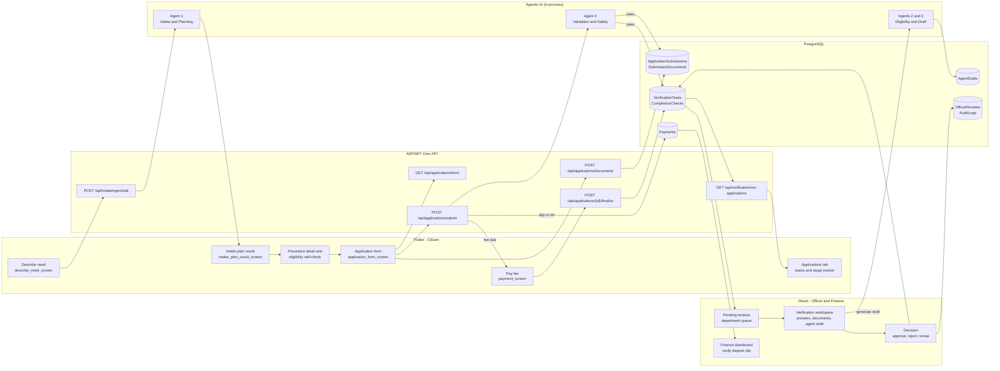
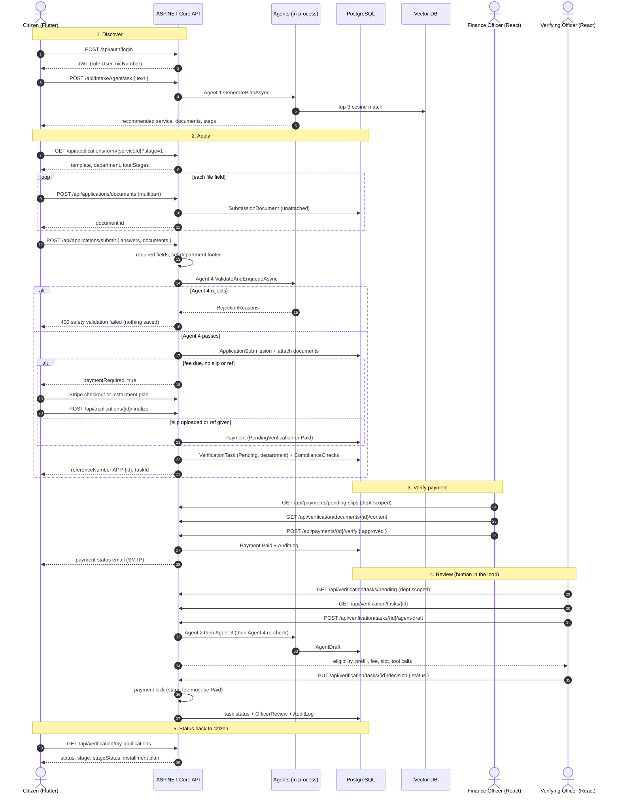
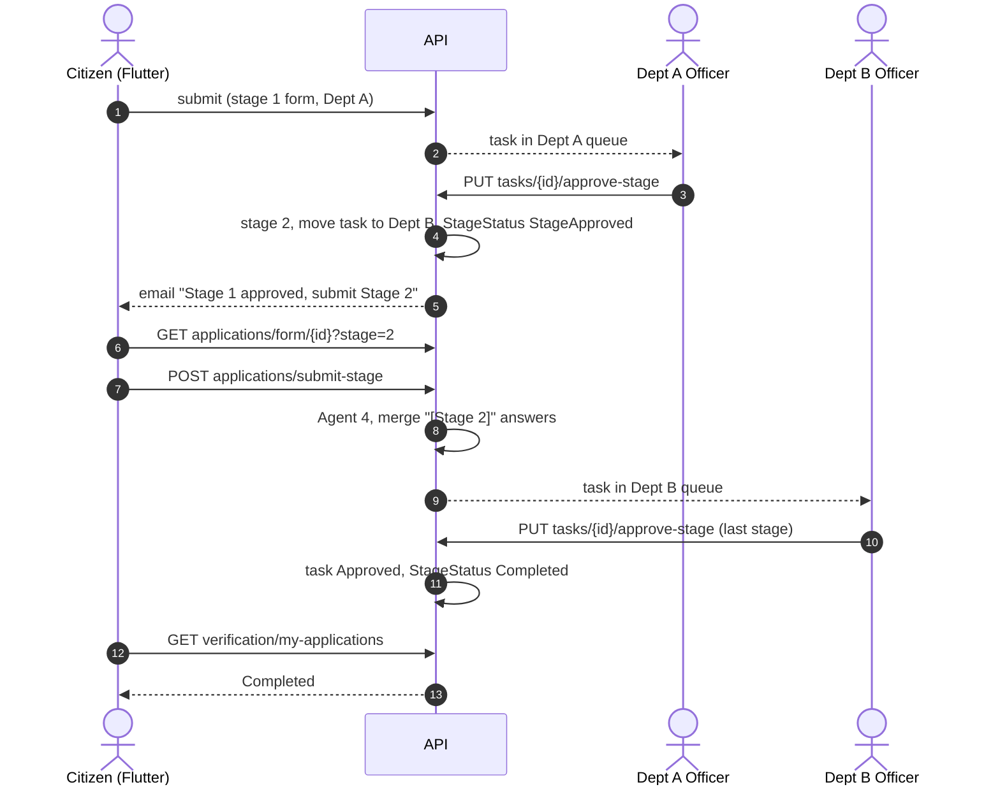

# End-to-End Cross-Platform Workflow

This is the minimum acceptance workflow from `docs/Government_Service_Navigator_Project_Plan.md` §3: the citizen applies in the **Flutter** app, the **ASP.NET Core** API validates and stores the application in **PostgreSQL**, the **agents** plan, check, draft and validate, an **officer in the React dashboard** decides, and the citizen's app shows the new status.

The steps below are the path the code actually takes as of 2026-09-29, with each hop mapped to its screen and endpoint. Related docs:
- `docs/api.md` for the request and response shapes
- `docs/diagrams/agentic-ai-architecture.md` for the agent internals
- `docs/diagrams/human-in-the-loop-workflow.md` for the review gate

## The pattern

Every cross-platform hop follows the same pattern:

1. **Clients never talk to each other.** Flutter and React share no channel. All state passes through the API and the app database.
2. **The API owns every state change.** Clients send intent (a submit, a decision); the server sets department, stage, payment status and task status.
3. **Agents run inside the API.** They run synchronously when a submit arrives, and on demand when an officer asks. They never write a final decision.
4. **A human commits every high-impact change.** Only an officer approves a stage, and only a finance officer verifies a slip. See the HITL doc.
5. **Clients pull status.** The citizen sees updates when the app refetches `my-applications`; nothing is pushed live. Email (SMTP) is the only push channel for application status.

## Swimlane overview

## Step-by-step sequence (single-stage service)

## Multi-stage, multi-department services

When a service has `TotalStages > 1`, steps 2-4 repeat once per stage. Each stage uses its own template, and each goes to its own department's queue (`docs/adr/0009-multi-stage-department-workflow.md`).

The web workspace picks the endpoint automatically: **Approve** calls `approve-stage` while `currentStage < maxStages`, and `decision` otherwise. Reject and Revise always call `decision`.

## Status the citizen sees

`GET /api/verification/my-applications` returns two status fields, and the applications tab reads both:

| Field | Source | Values | Shown as |
|---|---|---|---|
| `status` | `VerificationTask.Status` | `Pending`, `Approved`, `Rejected`, `Revised`, `Cancelled` | Officer outcome |
| `stageStatus` | `ApplicationSubmission.StageStatus` | `PendingReview`, `StageApproved`, `AwaitingFeePayment`, `Completed`, `Deleted` | Stage tracker and next-action banner ("submit next stage", "pay fee") |

The two fields are updated by different code paths:
- `decision` changes only the task `status`. A rejection or revision leaves `stageStatus` at `PendingReview` and sends the citizen no email.
- `approve-stage` changes both fields and sends an email.
- Finance verifying a payment sets `stageStatus` to `Completed`, even on a multi-stage application that still has stages left.

## How "real time" is achieved

| Channel | Used for | Mechanism |
|---|---|---|
| SignalR push (`/hubs/applications`) | Application status, payments, installments, notifications, refunds (citizen); queue and audit lists (staff) | An EF Core interceptor sees the commit, clears the cache, and sends `applicationsChanged` / `refundUpdated` to the citizen or `queueUpdated` to staff. Clients refetch over REST (ADR-0012) |
| Refetch on screen load / pull-to-refresh | Everything | Riverpod providers (`myApplicationsProvider`, `notificationsProvider`) and TanStack Query on the web re-query the API |
| Fallback polling | Application list (30 s), open refund (60 s) | Only while the app is in the foreground; catches anything a dropped connection missed |
| Email (SMTP) | Stage approved, payment status changed, installment reminder/cancellation | `NotificationService`, best effort |
| In-app notifications | Installment reminders and cancellations only | `InstallmentMonitorService` writes `CitizenNotification` rows |

An officer's decision normally reaches the citizen's open screen in about a second. The mobile app closes its socket in the background; on resume it refetches and reconnects. There are still no OS-level push notifications (FCM/APNs), so a citizen with the app closed only sees the change when they open it, or by email for the events above.

## Failure paths on the workflow

| Where | What happens | Citizen sees |
|---|---|---|
| Agent 1 finds no keyword match | `recommendedService: "Service Not Found"` | "Please contact the main helpdesk" plan |
| Required field missing | `400 { missingFields }` | Field errors on the form |
| Agent 4 rejects (injection, age, duplicate, missing docs) | `400 { errors, summary }`, nothing saved | Rejection reasons |
| Fee not covered on `finalize` | `402` with the outstanding amount | Payment screen again |
| Finance rejects the slip | Payment `Failed`; officer approval stays locked | Payment status email |
| Installment passes its due date unpaid | Hourly job cancels the plan, tasks and application | In-app notification + email |
| Officer rejects / requests revision | Task `Rejected` / `Revised` + `OfficerReview` comment | Status change on next refresh (no email) |
