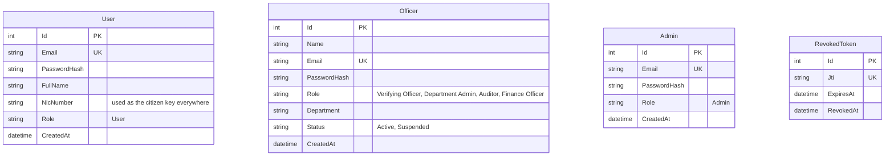
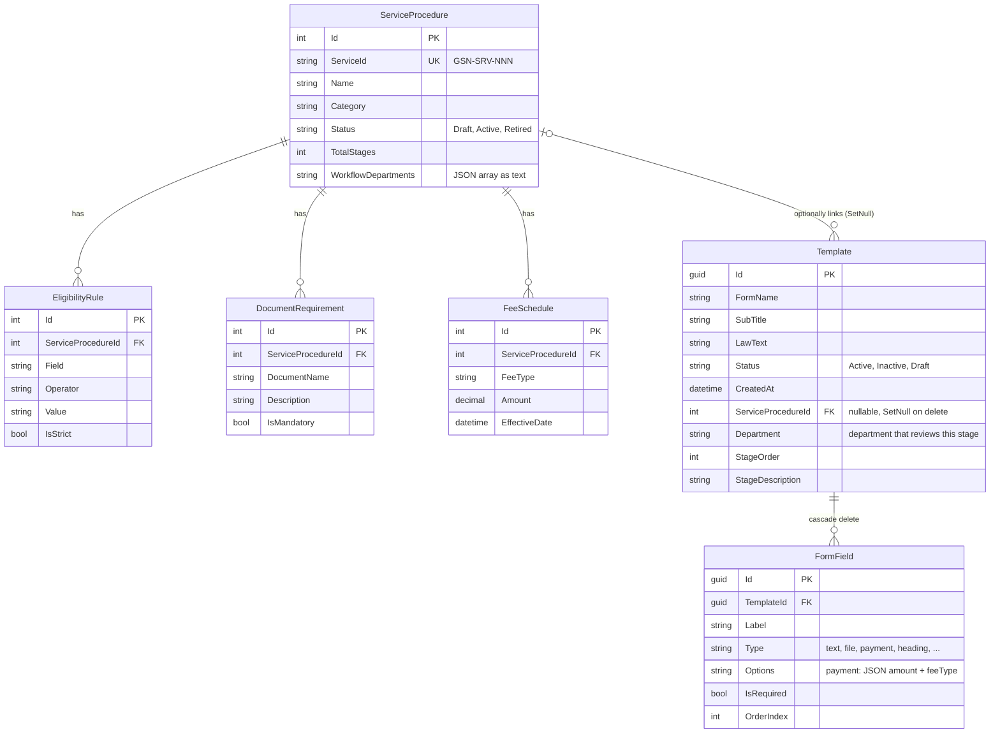
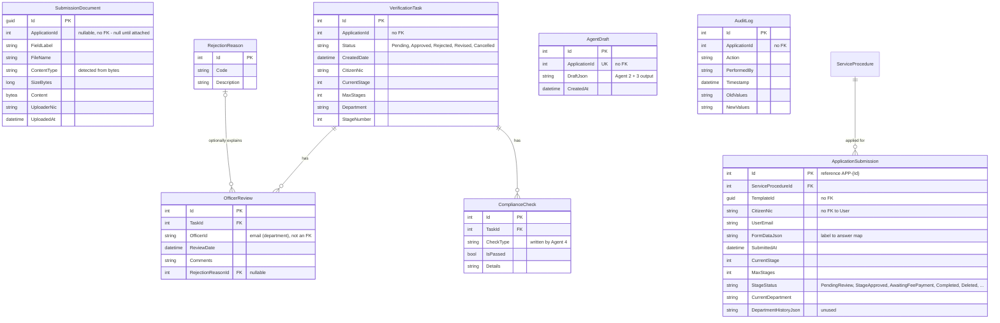
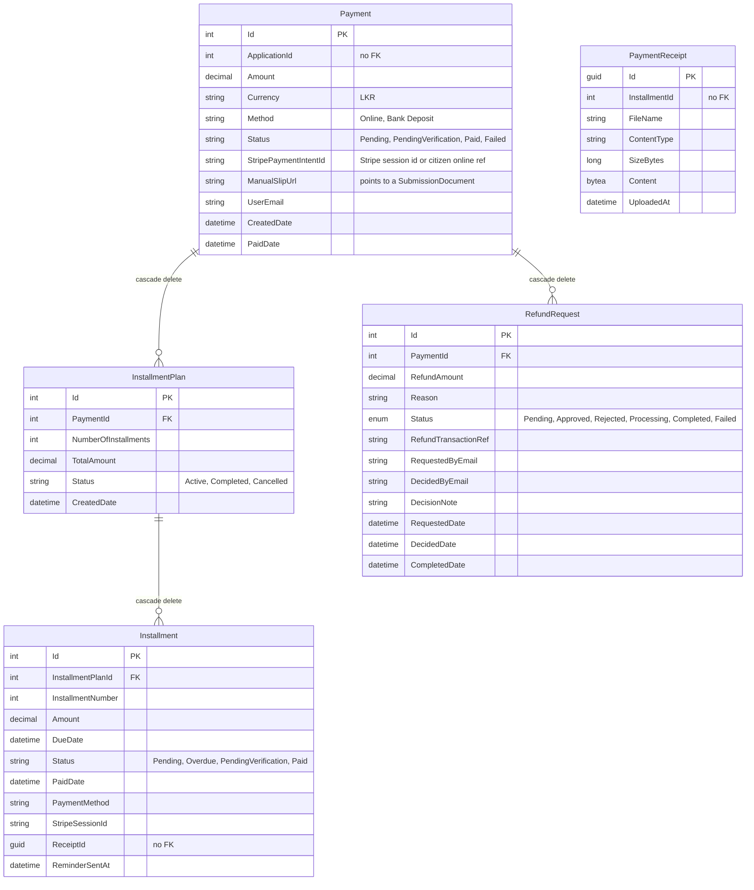
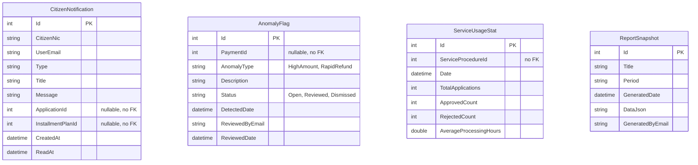
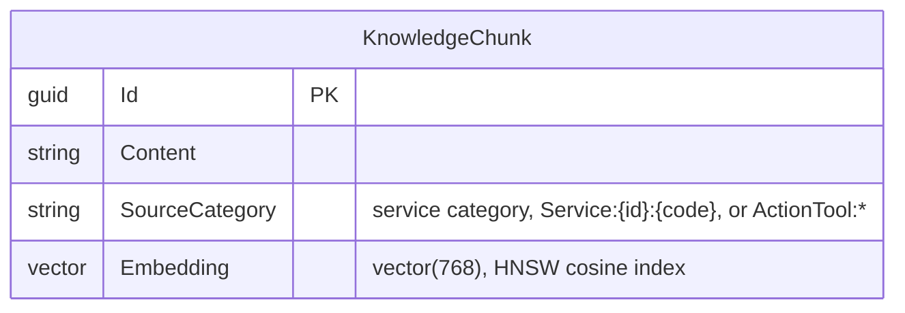

# Database ER Diagram

Reflects the actual EF Core model in `backend/src/Models/Entities/`, `backend/src/Data/Context/AppDbContext.cs` and the idempotent schema SQL in `Program.cs`, as of 2026-09-27. It doesn't show the aspirational schema in `docs/Government_Service_Navigator_Project_Plan.md`.

There are **two databases**:
- the **app DB** (`AppDbContext`, 27 tables)
- a **vector DB** (`VectorDbContext`, one table) used by the agents

The app DB is split into several diagrams below for readability. Dashed notes mark columns that look like foreign keys but aren't.

## Identity & auth

These tables have no relationships. `User`, `Officer` and `Admin` are unrelated tables (`docs/adr/0003-separate-user-officer-admin-tables.md`). `RevokedToken` stores only a JWT `jti` (`docs/adr/0001-jwt-auth-with-revocation-table.md`).

## Service catalog & forms

## Applications & verification

`ServiceProcedure` is repeated here only as the target of the one real foreign key. An application can have several `VerificationTask`s — one per stage submitted — all sharing its `ApplicationId`.

## Payments, installments, refunds

## Notifications & analytics

## Vector DB (`VectorDbContext`)

This table is in a **separate PostgreSQL database** with the `pgvector` extension (`ConnectionStrings:VectorDb`). It has no link to the app DB — chunks are text snapshots of catalog data, rebuilt with the `api/RagSetup` endpoints.

## Notes on real gaps (not diagram omissions)

- **Most application links are soft.** `ApplicationSubmission.Id` is the application's identity, but `VerificationTask`, `AuditLog`, `Payment`, `AgentDraft`, `SubmissionDocument` and `CitizenNotification` all reference it as a plain `int` with no foreign key. Deleting a submission leaves orphans, and nothing prevents a row pointing at an application that doesn't exist. `Program.cs` removes tasks with `ApplicationId == 0` on startup for this reason. When the task table is empty, it also **seeds four mock tasks with made-up application IDs**, so a fresh database always has orphan queue rows.
- **Citizens are linked by NIC string, not `User.Id`.** Submissions, tasks, documents and notifications store `CitizenNic`. Payments and refunds store an email instead, so "my payments" and "my applications" match on different identifiers.
- **Uploaded files live in the database** as `bytea` (`SubmissionDocument`, `PaymentReceipt`) — see `docs/adr/0010-uploaded-files-stored-in-database.md`.
- **Schema isn't fully captured by migrations.** `backend/src/Migrations` is gitignored, and newer tables and columns are created with `CREATE TABLE IF NOT EXISTS` / `ADD COLUMN IF NOT EXISTS` in `Program.cs`. Those include `AgentDrafts`, `SubmissionDocuments`, `InstallmentPlans`, `Installments`, `PaymentReceipts`, `CitizenNotifications`, and the stage columns on `ApplicationSubmissions`, `VerificationTasks`, `Templates` and `ServiceProcedures`. See `docs/adr/0005-auto-apply-migrations-on-startup.md`.
- **`OfficerReview.OfficerId`** is the string `"<email> (<department>)"` from the token, not a foreign key to `Officer.Id`.
