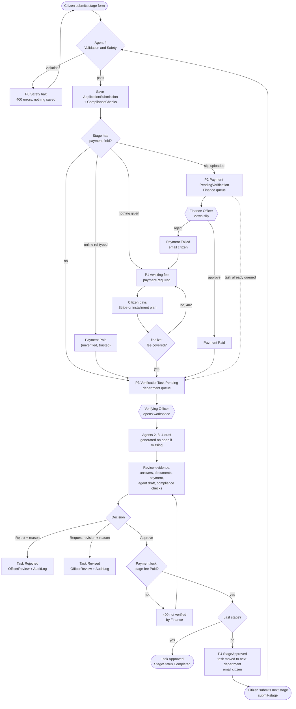
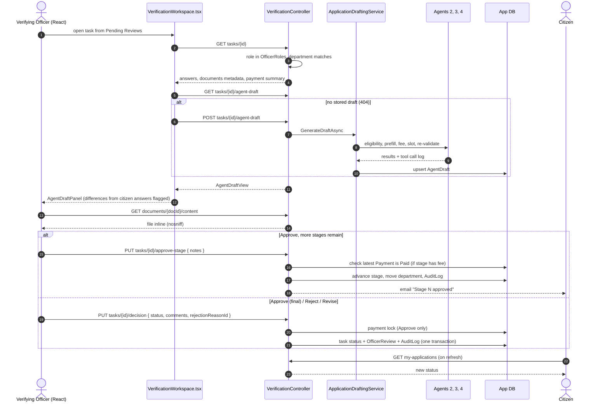
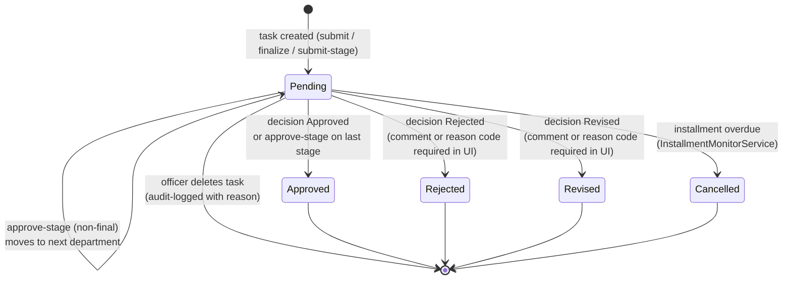

# Human-in-the-Loop: Pause, Review & Approval Workflow

The project plan (§2) names one **high-impact action that requires human approval**: *final acceptance of a citizen's application, which can commit fee charges or reserve a limited appointment slot.* Agents may plan, check, draft and validate, but a person decides.

This document shows where the workflow **pauses**, **who** resumes it, **what evidence** they see, and **which server-side guards** stop the pause from being skipped.

Related docs:
- `docs/diagrams/end-to-end-workflow.md` - the whole path
- `docs/diagrams/agentic-ai-architecture.md` - the agents

## Pause points at a glance

| # | Pause | Triggered by | Resumed by | Resume action | Server-side guard |
|---|---|---|---|---|---|
| P0 | **Safety halt** | Agent 4 finds a violation at submit | Citizen | Fix the form and resubmit | Nothing is saved, so nothing reaches the queue |
| P1 | **Awaiting fee** | Stage has a `payment` field and no slip or reference was given | Citizen | Pay (Stripe / installment plan), then `finalize` | `finalize` returns `402` until `Paid` payments or a started installment plan cover the fee |
| P2 | **Awaiting payment verification** | Deposit slip uploaded → `Payment.Status = PendingVerification` | **Finance Officer** | `POST /api/payments/{id}/verify` or `PUT /api/payments/{id}/status` | `FinanceRoles` + department check (`403` across departments) |
| P3 | **Awaiting officer review** | `VerificationTask.Status = Pending` in the department queue | **Verifying Officer** | `PUT tasks/{id}/decision` or `approve-stage` | `OfficerRoles` + department check. **Approval lock:** a stage with a `payment` field can't be approved until the latest payment is `Paid` |
| P4 | **Awaiting next-stage form** | `approve-stage` on a non-final stage → `StageStatus = StageApproved` | Citizen | `POST /api/applications/submit-stage` | Only the owning NIC can submit, and the template must belong to the service |
| P5 | **Awaiting installment verification** | Bank-transfer receipt uploaded → installment `PendingVerification` | Staff | `…/installments/{id}/pay` or `reject-transfer` | `StaffRoles` |
| P6 | **Awaiting refund decision** | Citizen requests a refund → `RefundRequest.Status = Pending` | **Finance Officer** | `POST /api/refunds/{id}/approve` or `reject` (reason required), then `process` and `complete` | `FinanceRoles` + the refund's stored department (`404` across departments) |

P2, P3, P5 and P6 are the **human approval gates**. P0 is an automated gate that keeps invalid work out of human queues. P1 and P4 are pauses waiting on the citizen.

## Flow

The dotted edge marks a real behaviour: when a slip is uploaded at submit, the verification task is created **at the same time** as the pending payment. The officer can see and review the application while Finance hasn't acted yet. The approval lock is what stops approval before verification.

## Officer review sequence

## Evidence the officer sees before deciding

| Evidence | Source | Shown in |
|---|---|---|
| Citizen's form answers (all stages, `[Stage N]` prefixed) | `ApplicationSubmission.FormDataJson` | Workspace |
| Uploaded documents, previewed inline | `SubmissionDocuments` via `documents/{id}/content` | Document preview |
| Payment method, amount, status, slip link | Latest `Payment` for the application | Workspace payment card |
| Eligibility result, missing criteria, matched and unmatched documents | Agent 2 (`AgentDraftView.eligibility`) | `AgentDraftPanel` |
| Pre-filled fields, **flagged where they differ from the citizen's answer** | Agent 3 `prefill_application` | `AgentDraftPanel` |
| Calculated fee, proposed appointment slot, notes for officer, blockers | Agent 3 | `AgentDraftPanel` |
| Tool call log (tool, input, output, time) | Agent 3 `toolCalls` | `AgentDraftPanel` |
| Compliance checks (schema, age, duplicates, injection, fee) | Agent 4 re-check during draft generation | `AgentDraftPanel` |
| Standard rejection codes | `RejectionReasons` | Decision form |

The draft is **advisory**. The officer can regenerate it (the re-run button), and nothing in it is applied to the application automatically. Proposed appointment slots aren't reserved anywhere.

## Decision outcomes

Every decision writes an `OfficerReview` (officer, time, comments, reason code) and an `AuditLog` with old and new values, attributed as `"<email> (<department>)"`. Deletions and payment verifications are audit-logged too.

## Guards that make the pause real

1. **No self-approval path for citizens.** The decision, approve-stage and payment-verify endpoints require staff roles. A citizen token (`role: User`) gets `403`.
2. **Department isolation.** Officers only see and open their own department's tasks and payments. System Admin (`Admin` / `System Admin` roles) sees all.
3. **Approval lock.** `decision` (Approved) and `approve-stage` refuse with `400` while a stage fee isn't `Paid`, which forces the Finance gate to happen first.
4. **Agent 4 before the queue.** Invalid or adversarial submissions never become tasks, so officers aren't asked to review them.
5. **Reason required for negative outcomes.** The React workspace blocks Reject / Request Revision without a comment or reason code, and the API requires a reason to reject a refund or a manual payment.
6. **LLM output is advisory.** When the Groq LLM is on, it writes plans, eligibility reasoning, officer briefings and decision-order drafts. None of these changes an application: Agent 4's deterministic gates still decide what reaches the queue, and a decision order only fills in the officer's decision form (ADR-0015).

## Where the loop can be bypassed or is weak

These are current gaps. They're documented here so the HITL claim isn't overstated.

- **Bulk verify skips the approval lock.** `POST tasks/bulk-verify` applies `Approved` to many tasks without the payment check.
- **"Online Ref:" is trusted.** A typed reference creates a `Paid` payment with no verification, which satisfies the approval lock (`docs/adr/0011-stripe-checkout-without-webhooks.md`).
- **The lock checks the latest payment, not this stage's payment.** A paid earlier-stage fee can satisfy a later stage (`docs/adr/0009-multi-stage-department-workflow.md`).
- **Revision doesn't notify or reopen.** `Revised` only changes the task status: the citizen gets no email, `StageStatus` stays `PendingReview`, and there's no dedicated resubmit flow in the app for a revised stage. The citizen sees the status on refresh.
- **Regenerating a draft or compiling a dossier can reset a decided task to `Pending`.** Both re-run Agent 4, and so do the unauthenticated `ValidationAgent` `validate`, `orchestrate` and `briefing` endpoints. If the checks pass, Agent 4 calls the task enqueuer, which reuses the task and sets `Pending` (`docs/diagrams/agentic-ai-architecture.md`).
- **Collection appointments are confirmed by Agent 3 alone.** `POST /api/ActionAgent/book-appointment` is unauthenticated and saves a `Confirmed` booking whenever the parsed time fits a slot with space. It takes a limited slot without an officer, which is the kind of action the project plan says needs approval. Department admins see bookings afterwards and can't approve or decline them.
- **Compliance checks stored at submit aren't shown.** The `ComplianceChecks` rows written at submit aren't returned by `GET tasks/{id}`. The officer only sees the checks from the draft-time re-run.
