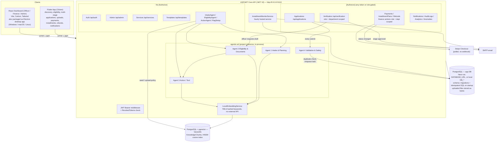

# System Architecture

Reflects what's actually running as of 2026-09-27. Every component in `docs/Government_Service_Navigator_Project_Plan.md` now exists in some form, including:
- the four-agent workflow
- citizen application submission (Component B)
- payments, notifications and analytics

The agents run in-process and deterministically, not as a separate LLM-backed service (`docs/adr/0008-deterministic-in-process-agents.md`).

## Request flow: a citizen application

1. The citizen picks a service in Flutter. The app loads the stage form with `GET /api/applications/form/{serviceId}?stage=1` and uploads files with `POST /api/applications/documents`.
2. `POST /api/applications/submit` runs **Agent 4** synchronously. If it rejects, nothing is saved.
3. If the stage has a `payment` field, the fee is taken in one of three ways:
   - A deposit slip is uploaded → the payment is `PendingVerification`.
   - An online reference is given → the payment is `Paid`.
   - Neither → the citizen pays through Stripe or an installment plan, then calls `finalize`.
4. A `VerificationTask` lands in the queue of the stage's department. A Finance Officer verifies the slip. A Verifying Officer can generate the **Agent 2 + 3** draft and then approves the stage. Approval is locked until the payment is `Paid`.
5. `approve-stage` moves the task to the next stage's department and emails the citizen, who submits the next form with `submit-stage`. After the last stage, the application is `Completed`.

See `docs/adr/0009-multi-stage-department-workflow.md` for how stages are modelled.

## What's actually enforced vs. what looks enforced

Registering the JWT middleware globally isn't the same as a controller requiring it. As of this writing:

- **Enforced, with role and department checks:** the `VerificationController` officer actions, the finance actions in `PaymentsController` (`pending-slips`, `department-payments`, `verify`, `status`), and the staff actions in `InstallmentPlansController`. These read the `role` and `department` claims server-side and `403` cross-department access.
- **Token required, but any role accepted:** `Applications`, `Notifications`, `AuditLogs`, `Analytics`, `Anomalies`, `Refunds` and the citizen side of payments/installments. A citizen token can therefore approve refunds and read every audit log.
- **No auth at all:** `Admin`, `Services`, `Templates`, all four agent endpoints and `RagSetup`. Anyone who can reach the API can create officers, edit the service catalog, or wipe the vector knowledge base.

See `docs/api.md` for the per-endpoint breakdown and `docs/adr/0004-client-side-department-scoping.md` for the scoping history.

## Configuration

| Setting | Read from | Notes |
|---|---|---|
| App DB | `DATABASE_URL` (preferred, SSL required) or `DB_HOST`/`DB_PORT`/`DB_NAME`/`DB_USER`/`DB_PASSWORD` | Startup throws if neither is complete |
| Vector DB | `ConnectionStrings:VectorDb` in `appsettings.json` | **Not** an env var. There's also a hardcoded copy in `VectorDbContextFactory` for design-time `dotnet ef` |
| JWT | `JWT_KEY`, `JWT_ISSUER`, `JWT_AUDIENCE` | Without `JWT_KEY`, the auth scheme isn't registered at all. `JWT_EXPIRY_HOURS` is unused (7 days is hardcoded) |
| Stripe | `STRIPE_SECRET_KEY` | |
| Email | `SMTP_HOST`, `SMTP_PORT`, `SMTP_USER`, `SMTP_PASSWORD`, `SMTP_FROM_EMAIL`, `SMTP_FROM_NAME`, `SMTP_USE_SSL` | Best effort — failures don't fail the request |
| Bank transfer details | `BANK_ACCOUNT_NAME`, `BANK_NAME`, `BANK_BRANCH`, `BANK_ACCOUNT_NUMBER` | Missing from `.env.example` |
| Agent 4 | `ValidationSafetyConfig` singleton in `Program.cs` | Hardcoded: block duplicates, minimum age 16, adversarial filter on |

CORS allows any origin, header and method. HTTPS redirection is commented out.

## Client → API base URLs

Neither client reads an environment variable for the API base URL:

- **React:** `http://localhost:5119` is hardcoded — in `web/src/utils/api.ts` (`BASE_URL`), and as a literal in many page components.
- **Flutter:** `mobile/lib/config/app_config.dart` picks one per platform: `http://10.0.2.2:5119/api` on the Android emulator, `http://localhost:5119/api` everywhere else. A physical device needs this file edited to the host's LAN IP.

## Build & delivery

GitHub Actions has one workflow per piece:
- CI: `backend-ci.yml`, `web-ci.yml`, `mobile-ci.yml`, `agentic-ai.yml`
- Packaged builds: `build-android.yml`, `ios-build.yml`, `windows-software-build.yml`, `mac-build.yml`, `linux-build.yml`

The web dashboard ships as an Electron app (`web/electron/main.cjs`, `npm run dist:win|mac|linux`). Windows staff install it with `install/install.ps1`, which pulls the latest GitHub Release.
