# System Architecture

Reflects what's actually running in release v3.0.0. Every component in `docs/Government_Service_Navigator_Project_Plan.md` now exists in some form, including:
- the four-agent workflow
- citizen application submission (Component B), with collection appointments
- payments, notifications and analytics

The agents run in-process, not as a separate service. Their tools are deterministic, and a Groq-hosted LLM reasons over the tool results when `GROQ_API_KEY` is set (`docs/adr/0008-deterministic-in-process-agents.md`, `docs/adr/0015-groq-llm-over-deterministic-agents.md`).

The API is hosted on Azure App Service as a Docker container and the web dashboard on Vercel (`docs/adr/0016-container-on-azure-app-service-web-on-vercel.md`, `docs/azure-hosting.md`).

```mermaid
graph TB
    subgraph Clients
        Flutter["LankaServe - Flutter App (Citizen)<br/>discovery, eligibility, multi-stage<br/>applications, uploads, revisions, payments,<br/>installments, refunds, bookings,<br/>notifications"]
        React["React Dashboard (Officer / Finance / Admin)<br/>Vite, Carbon, Tailwind, hosted on Vercel<br/>also packaged as Electron desktop app<br/>(Windows / macOS / Linux)"]
    end

    subgraph Backend["ASP.NET Core API (.NET 10) - Azure App Service container, port 8080 (5119 locally)"]
        JwtMw["JWT Bearer middleware<br/>+ revocation check (Redis or memory)<br/>+ rate limiter, compression"]
        Hub["SignalR hub /hubs/applications<br/>citizens by NIC, staff group"]
        Interceptor["Change interceptor<br/>after commit: clear cache, then push"]
        Cache["HybridCache<br/>catalog, citizen application lists"]

        subgraph Open["No [Authorize]"]
            Auth["Auth /api/auth"]
            Admin["Admin /api/admin<br/>Departments /api/departments"]
            Services["Services /api/services"]
            Templates["Templates /api/templates"]
            AgentApi["IntakeAgent / EligibilityAgent /<br/>ActionAgent / ValidationAgent / RagSetup"]
        end

        subgraph Authed["[Authorize] (any token or role-gated)"]
            Apps["Applications /api/applications"]
            Verification["Verification /api/verification<br/>role + department scoped"]
            Payments["Payments / InstallmentPlans / Refunds<br/>finance actions role + dept scoped"]
            Misc["Notifications / AuditLogs /<br/>Analytics / Anomalies"]
            Slots["Collection slots /api/admin/collection-slots<br/>staff-role writes, anonymous reads"]
        end

        subgraph Agentic["agentic-ai/ (project reference, in-process)"]
            A1["Agent 1 Intake & Planning"]
            A2["Agent 2 Eligibility & Documents"]
            A3["Agent 3 Action / Tool"]
            A4["Agent 4 Validation & Safety"]
        end

        Embed["LocalEmbeddingService<br/>768-d hashed keywords, no external API"]
        Llm["GroqLlmService<br/>optional, JSON chat completions"]
        Monitor["InstallmentMonitorService<br/>hourly hosted service"]
        Repair["DataRepairService<br/>every 10 min"]
    end

    DB[("PostgreSQL - app DB<br/>Neon via DATABASE_URL, or local DB_*<br/>schema: migrations + idempotent SQL on startup<br/>uploaded files stored as bytea")]
    VDB[("PostgreSQL + pgvector - VectorDb<br/>KnowledgeChunks, HNSW cosine index")]
    Redis[("Redis - optional (REDIS_URL)<br/>cache L2, revoked tokens,<br/>SignalR backplane")]
    Stripe["Stripe Checkout<br/>(polled, no webhook)"]
    SMTP["SMTP email"]
    Groq["Groq API<br/>(GROQ_API_KEY)"]

    Flutter -- "HTTP + JWT" --> Backend
    React -- "HTTP + JWT" --> Backend
    Hub -. "WebSocket push:<br/>applicationsChanged / queueUpdated" .-> Flutter
    Hub -. "queueUpdated" .-> React

    Apps -- "every submit" --> A4
    Verification -- "officer requests draft" --> A2
    A2 --> A3
    AgentApi --> A1
    AgentApi --> A2
    AgentApi --> A3

    A1 --> Embed
    A2 --> Embed
    A3 --> Embed
    Embed --> VDB
    A1 & A2 & A3 & A4 -. "if configured" .-> Llm
    Llm --> Groq
    AgentApi -- "book-appointment" --> Slots
    Slots --> DB
    AgentApi -- "seed / upload-policy" --> VDB

    Backend --> DB
    A4 -- "duplicate check,<br/>enqueue task" --> DB
    Payments --> Stripe
    Monitor --> DB
    Monitor --> SMTP
    Repair --> DB
    DB -- "SaveChanges" --> Interceptor
    Interceptor --> Cache
    Interceptor --> Hub
    Cache --> Redis
    JwtMw --> Redis
    Hub -. "backplane" .-> Redis
    Verification -- "stage approved" --> SMTP
    Payments -- "status changed" --> SMTP
```

## Request flow: a citizen application

1. The citizen picks a service in Flutter. The app loads the stage form with `GET /api/applications/form/{serviceId}?stage=1` and uploads files with `POST /api/applications/documents`.
2. `POST /api/applications/submit` runs **Agent 4** synchronously. If it rejects, nothing is saved. A duplicate application is flagged for the officer, not rejected. If the citizen already has an unfinished row for the service (a draft, an unpaid placeholder, or a submission that never reached the queue), the submit reuses it.
3. If the stage has a `payment` field, the fee is taken in one of three ways:
   - A deposit slip is uploaded → the payment is `PendingVerification`.
   - An online reference is given → the payment is `Paid`.
   - Neither → the citizen pays through Stripe or an installment plan, then calls `finalize`.
4. A `VerificationTask` lands in the queue of the stage's department. A Finance Officer verifies the slip. A Verifying Officer can generate the **Agent 2 + 3** draft, compile an Agent 4 dossier or decision order, and then approves the stage. Approval is locked until the payment is `Paid`.
5. `approve-stage` moves the task to the next stage's department and emails the citizen, who submits the next form with `submit-stage`. After the last stage, the application is `Completed`. If the officer asks for a revision instead, the citizen answers from the app with `POST /api/applications/{id}/submit-revision`, which puts the task back to `Pending`.
6. The citizen books a collection appointment in plain language (`POST /api/ActionAgent/book-appointment`). **Agent 3** fits it into the department's collection slots and confirms it straight away. The department admin sees it on the Collection Slots page.

See `docs/adr/0009-multi-stage-department-workflow.md` for how stages are modelled.

## Performance layer

Added for 1000+ daily users (`docs/performance-and-redis.md`):

- **Push, not polling.** Any `SaveChanges` that changes what a citizen or officer sees is picked up by an EF Core interceptor. After the commit it clears the affected cache entries and sends a SignalR message. Clients then refetch over REST. The mobile app keeps only a 30 s fallback poll, and only while it is in the foreground. See ADR-0012.
- **Cache.** `HybridCache` holds the service catalog and each citizen's application list in process memory, and in Redis when `REDIS_URL` is set. See ADR-0013.
- **Revocation check.** Redis, or a short in-memory cache, instead of a database lookup on every request.
- **Bounded lists.** Growing lists are paged on the server; unpaged calls return at most 200 rows. See ADR-0014.
- **Read-only GETs.** Data repairs that used to run inside GET endpoints run in `DataRepairService`, once about 15 s after startup and then every 10 minutes. Besides those repairs, it marks a `PendingReview` submission `Deleted` when its verification task is still `Pending`, is more than **1 hour** old and has no officer review. The code comment says 24 hours; the threshold in code is 1 hour, so a genuine application that waits in the queue for an hour is removed from it.
- **Protection.** A per-caller rate limit (default 120 requests/min) and Brotli/gzip compression.
- **Web bundle.** Each page is lazy-loaded, so the first load is about 286 KB instead of 1.46 MB.

With Redis configured, the API can run as several instances: cache, revocation and SignalR are shared. Without it, run a single instance.

Detailed diagrams:
- `docs/diagrams/end-to-end-workflow.md` - the full cross-platform path, with sequence diagrams
- `docs/diagrams/agentic-ai-architecture.md` - agent components, tools, RAG and the pipeline state machine
- `docs/diagrams/human-in-the-loop-workflow.md` - the pause points, approval gates and guards

## What's actually enforced vs. what looks enforced

Registering the JWT middleware globally isn't the same as a controller requiring it. As of this writing:

- **Enforced, with role and department checks:** the `VerificationController` officer actions, the finance actions in `PaymentsController` (`pending-slips`, `department-payments`, `verify`, `status`), and the staff actions in `InstallmentPlansController`. These read the `role` and `department` claims server-side and `403` cross-department access.
- **Also role- and department-checked:** the finance actions in `RefundsController`.
- **Role-checked but not department-checked:** writes in `CollectionSlotsController`. Any staff role can change any department's slots and holidays.
- **Token required, but any role accepted:** `Applications` (except the two below), `Notifications`, `AuditLogs`, `Analytics`, `Anomalies`, and the citizen side of payments, installments and refunds. A citizen token can therefore read every audit log and run the anomaly scan.
- **No auth at all:** `Admin`, `Departments`, `Services`, `Templates`, all the agent endpoints (including `ValidationAgent` and `book-appointment`), `RagSetup`, the reads in `CollectionSlotsController`, and the citizen actions `applications/{id}/raise-concern` and `applications/{id}/submit-revision`. The last one lets anyone put any application back in the officer queue. Now that the API is hosted, anyone who finds the URL can create officers, edit departments and the service catalog, or wipe the vector knowledge base.

See `docs/api.md` for the per-endpoint breakdown and `docs/adr/0004-client-side-department-scoping.md` for the scoping history.

## Configuration

| Setting | Read from | Notes |
|---|---|---|
| App DB | `DATABASE_URL` (preferred, SSL required) or `DB_HOST`/`DB_PORT`/`DB_NAME`/`DB_USER`/`DB_PASSWORD` | Startup throws if neither is complete |
| Vector DB | `ConnectionStrings:VectorDb` in `appsettings.json` | Not in `.env`. It can be overridden with the `ConnectionStrings__VectorDb` environment variable. There's also a hardcoded copy in `VectorDbContextFactory` for design-time `dotnet ef` |
| JWT | `JWT_KEY`, `JWT_ISSUER`, `JWT_AUDIENCE` | Without `JWT_KEY`, the auth scheme isn't registered at all. `JWT_EXPIRY_HOURS` is unused (7 days is hardcoded) |
| LLM | `GROQ_API_KEY`, `GROQ_MODEL` (or `Groq:ApiKey` / `Groq:Model` in config) | Optional. Without a key the agents run deterministically. Default model `openai/gpt-oss-120b` |
| Port | `ASPNETCORE_HTTP_PORTS` or `ASPNETCORE_URLS` | When either is set (8080 in Docker) the API uses it; otherwise it listens on `http://0.0.0.0:5119` |
| Stripe | `STRIPE_SECRET_KEY` | |
| Email | `SMTP_HOST`, `SMTP_PORT`, `SMTP_USER`, `SMTP_PASSWORD`, `SMTP_FROM_EMAIL`, `SMTP_FROM_NAME`, `SMTP_USE_SSL` | Best effort - failures don't fail the request |
| Bank transfer details | `BANK_ACCOUNT_NAME`, `BANK_NAME`, `BANK_BRANCH`, `BANK_ACCOUNT_NUMBER` | Missing from `.env.example` |
| Agent 4 | `ValidationSafetyConfig` singleton in `Program.cs` | Hardcoded: duplicates flagged but not blocked (`BlockDuplicateSubmissions = false`), minimum age 16, adversarial filter on |
| Redis | `REDIS_URL` | Optional. Empty = in-process cache, single instance. Keep it in the same region as the API; a distant Redis adds its round trip to every request |
| DB pool | `DB_MAX_POOL_SIZE` | Default 50 per instance. Use Neon's pooled (`-pooler`) connection string |
| Rate limit | `RATE_LIMIT_PER_MINUTE` | Default 120 per caller. Raise it for k6 load tests, where all virtual users share one token |
| Web API base | `BASE_URL` (web build, `web/.env.production`) | Passed in by `web/vite.config.ts` and exported as `API_BASE_URL` from `web/src/utils/api.ts`; every page uses it |

CORS allows any origin, header and method. HTTPS redirection is commented out.

## Client → API base URLs

- **React:** `web/src/utils/api.ts` exports `API_BASE_URL` from `BASE_URL` (falling back to `http://localhost:5119`), and every page and the realtime bridge use it. `npm run dev` reads `web/.env` (localhost); `vite build` reads `web/.env.production`, which points at the hosted Azure API. That covers the Vercel site and the desktop builds.
- **Flutter:** `mobile/lib/config/app_config.dart` defaults to the hosted Azure API. The app keeps the citizen signed in across launches: `SessionStorage` (`mobile/lib/services/session_storage.dart`) saves the token, email and user in `flutter_secure_storage` (Android Keystore / iOS Keychain), and the loading page restores it. It's cleared on sign-out or once the token has expired. `flutter run --dart-define=API_URL=http://localhost:5119` (or `http://10.0.2.2:5119` on the Android emulator, or the host's LAN IP on a phone) points it at a local backend. `baseUrl` adds `/api`, and the realtime hub URL is derived from the same value.

## Build & delivery

GitHub Actions has one workflow per piece:
- CI: `backend-ci.yml`, `web-ci.yml`, `mobile-ci.yml`, `agentic-ai.yml`
- Deploy: `main_gsn-api.yml` builds the root `Dockerfile`, pushes it to Azure Container Registry `gsnacr` and deploys it to the App Service `gsn-api` on every push to `main` that touches the backend or agents
- Packaged builds: `build-android.yml`, `ios-build.yml`, `windows-software-build.yml`, `mac-build.yml`, `linux-build.yml`

The web dashboard is deployed to Vercel from `web/` (`vercel.json` rewrites every route to `index.html`). It also ships as an Electron app (`web/electron/main.cjs`, `npm run dist:win|mac|linux`). Windows staff install it with `install/install.ps1`, which pulls the latest GitHub Release. Pushing a `v*` tag runs `windows-software-build.yml`, which creates that release with the installer attached and uses `.github/release-notes/<tag>.md` as its description when the file exists (`v2.0.0.md`, `v3.0.0.md`). If a release for the tag already exists (for example one created by hand), it keeps that release's title and notes and only uploads the installers, replacing any with the same name.
